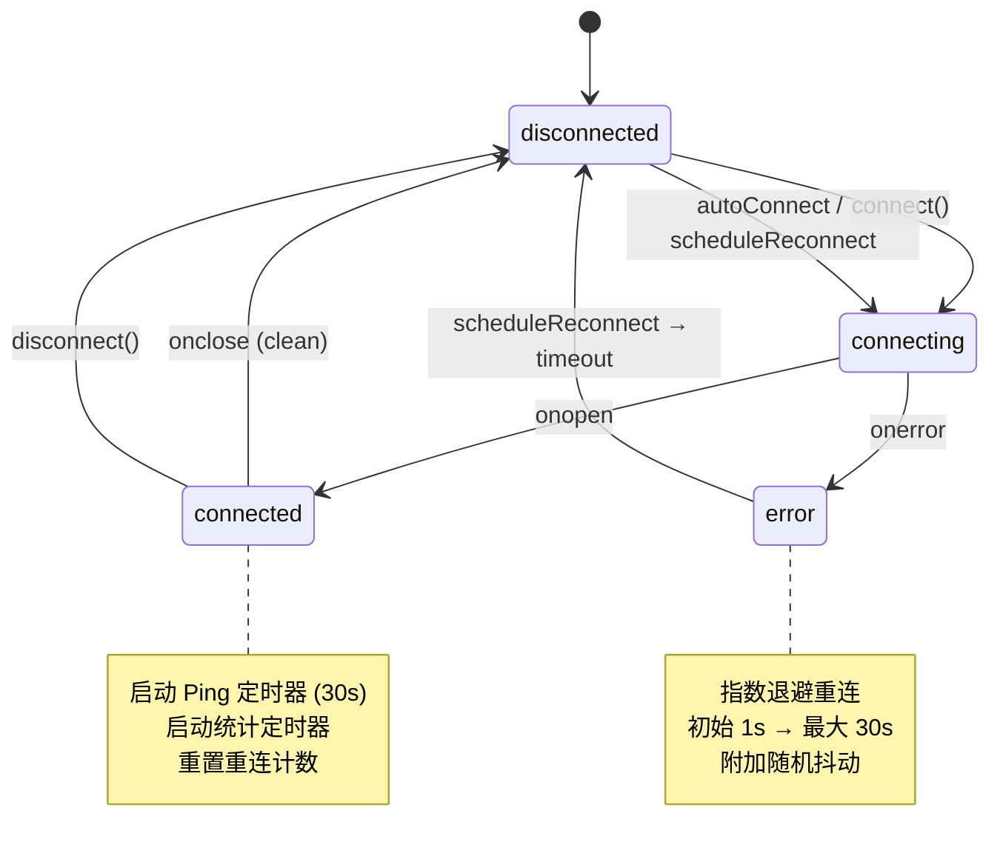
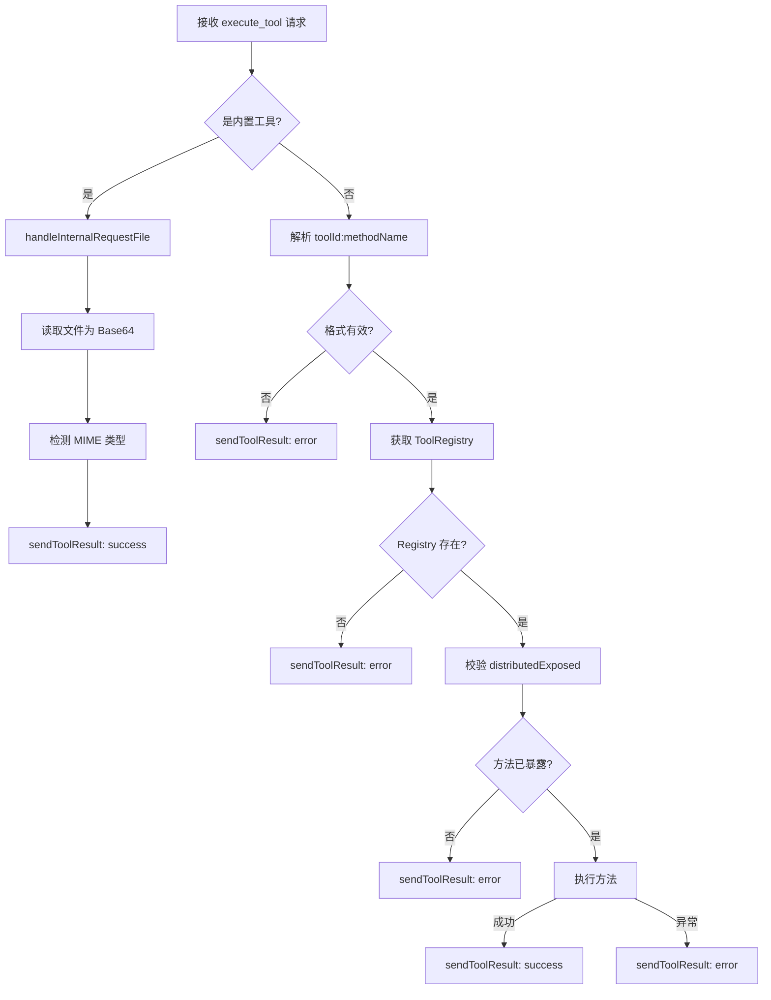

# VCP Connector 实现细节：Store、Service 与 Composable

本文档详细描述了 `vcp-connector` 模块的内部实现细节，包括状态管理、协议服务和生命周期组合函数。

## 1. 状态层详解 (Store)

### 1.1. vcpConnectorStore（主 Store）

[`vcpConnectorStore`](../stores/vcpConnectorStore.ts) 是模块的核心状态中心，负责管理连接、消息和过滤。

#### 核心状态

| 状态            | 类型              | 说明                             |
| --------------- | ----------------- | -------------------------------- |
| `config`        | `VcpConfig`       | 连接配置（URL、Key、模式等）     |
| `connection`    | `ConnectionState` | 连接状态（状态、延迟、重连次数） |
| `messages`      | `VcpMessage[]`    | 接收到的消息列表                 |
| `filter`        | `FilterState`     | 过滤条件（类型、关键词、暂停）   |
| `stats`         | `MessageStats`    | 消息统计（各类型计数、消息速率） |
| `nodeProtocol`  | `VcpNodeProtocol` | 分布式协议处理器实例             |
| `ws`            | `WebSocket`       | Observer WebSocket 实例          |
| `distributedWs` | `WebSocket`       | Distributed WebSocket 实例       |
| `vcpLogWs`      | `WebSocket`       | VCPLog WebSocket 实例            |

#### 连接生命周期



#### 三 WebSocket 管理

Store 内部维护三条独立的 WebSocket 连接，各自有独立的连接守卫和状态管理：

- **Observer WS** ([`connectObserver()`](../stores/vcpConnectorStore.ts:414)): 接收广播消息，维护 Ping/Pong 心跳。
- **VCPLog WS** ([`connectVcpLog()`](../stores/vcpConnectorStore.ts:535)): 接收普通日志和工具审批请求（`tool_approval_request`），并发送审批响应。
- **Distributed WS** ([`connectDistributed()`](../stores/vcpConnectorStore.ts:604)): 核心业务通道，处理以下逻辑：
  - 工具注册确认与节点 ID 分配（`connection_ack`, `assign_node_id`）。
  - 处理来自 VCP 的工具执行请求（`execute_tool`）。
  - 处理工具调用审批（`tool_approval_request`）。
  - 桥接工厂初始化与清单拉取（`vcp_manifest_response`）。
  - 转发远程工具执行结果与异步进度（`vcp_tool_result`, `vcp_tool_status`）。

[`attemptConnect()`](../stores/vcpConnectorStore.ts:377) 根据 `config.mode` 决定启动哪些连接。

#### 消息处理流水线

```
WebSocket.onmessage
    ↓
JSON.parse()
    ↓
parseMessage() ──→ 类型校验 + 时间戳补全
    ↓
addMessage() ──→ 暂停检查 → 推入列表 → 更新统计 → 防抖持久化 → 历史上限裁剪
    ↓
filteredMessages (computed) ──→ 类型过滤 → 关键词搜索 → UI 渲染
```

#### 关键词搜索

[`filteredMessages`](../stores/vcpConnectorStore.ts) 的关键词搜索针对每种消息类型搜索不同字段：

| 消息类型                     | 搜索字段                                  |
| ---------------------------- | ----------------------------------------- |
| `RAG_RETRIEVAL_DETAILS`      | query, dbName, results[].text             |
| `META_THINKING_CHAIN`        | query, chainName                          |
| `AGENT_PRIVATE_CHAT_PREVIEW` | agentName, query, response                |
| `AI_MEMO_RETRIEVAL`          | extractedMemories                         |
| `PLUGIN_STEP_STATUS`         | pluginName, stepName                      |
| `vcp_log`                    | data.content, data.tool_name, data.source |

#### 日志通知处理

[`handleVcpLogNotification()`](../stores/vcpConnectorStore.ts) 实现智能路由逻辑，根据日志内容类型推送不同通知：

1. **错误优先**: `status === 'error'` 直接推送错误通知
2. **任务 ID 提取**: 从内容中提取 `task_id` 或 `任务 XXX` 格式，推送任务启动通知
3. **关键字检测**: 包含 "error"/"failed" 推送错误通知
4. **成功提示**: 包含 "归档"/"完成"/"成功" 使用 `customMessage.success` 浮动提示

### 1.2. vcpDistributedStore（分布式 Store）

[`vcpDistributedStore`](../stores/vcpDistributedStore.ts) 管理分布式节点的状态和配置。

#### 核心状态

| 状态            | 类型                   | 说明                        |
| --------------- | ---------------------- | --------------------------- |
| `config`        | `VcpDistributedConfig` | 分布式配置                  |
| `nodeId`        | `string \| null`       | VCP 服务器分配的节点 ID     |
| `status`        | 连接状态枚举           | 分布式连接状态              |
| `exposedTools`  | `VcpToolManifest[]`    | 当前已同步到 VCP 的工具清单 |
| `pendingExposedTools` | `VcpToolManifest[]` | 已发送、等待确认或兼容确认的工具清单 |
| `lastHeartbeat` | `number \| null`       | 最近一次心跳时间戳          |

#### 工具管理方法

| 方法                      | 说明                    |
| ------------------------- | ----------------------- |
| `registerToolToVcp()`     | 手动添加工具到暴露列表  |
| `unregisterToolFromVcp()` | 从暴露列表移除工具      |
| `toggleToolDisabled()`    | 切换工具的禁用/启用状态 |
| `setPendingExposedTools()` | 记录已发起同步、尚未确认的工具清单 |
| `confirmPendingExposedTools()` | 将待确认清单提升为已同步清单 |

---

## 2. 服务层详解 (Service)

### 2.1. VcpNodeProtocol

[`VcpNodeProtocol`](../services/vcpNodeProtocol.ts) 是分布式通信的协议处理器，封装了 AIO ↔ VCP 之间的所有协议消息。

#### 出站消息 (AIO → VCP)

| 方法                         | 协议类型                 | 说明                  |
| ---------------------------- | ------------------------ | --------------------- |
| `sendRegisterTools()`        | `register_tools`         | 注册 AIO 工具清单     |
| `sendReportIp()`             | `report_ip`              | 上报节点 IP 信息      |
| `sendToolResult()`           | `tool_result`            | 回传 AIO 工具执行结果 |
| `sendToolApprovalResponse()` | `tool_approval_response` | 回传人工审批结果      |

#### 入站消息处理 (VCP → AIO)

1. **`handleExecuteTool()`**: 核心入站执行逻辑。
2. **`handleToolApprovalRequest()`**: 处理来自 VCP 的审批请求，调用 `toolCallingStore` 触发 UI。
3. **`handleVcpManifestsResponse()`**: 转发清单响应给桥接工厂。
4. **`handleVcpToolResult()`**: 转发远程执行结果给桥接工厂。

[`handleExecuteTool()`](../services/vcpNodeProtocol.ts) 的执行流程：



**安全校验**: 即使工具方法存在，也必须在 [`getMetadata()`](../services/vcpNodeProtocol.ts) 中标记 `agentCallable: true` 或 `distributedExposed: true`，并且没有被分布式配置禁用，才允许远程执行，防止未授权调用。

**超时约定**: VCP 主服务器的分布式执行默认超时为 60 秒，并会优先读取工具 manifest 的 `communication.timeout`。AIO 在注册分布式工具时统一声明 120 秒超时；节点本地执行再用 115 秒保护提前返回 `tool_result` 错误，避免主服务器只收到硬超时。

---

## 3. 组合层详解 (Composable)

### 3.1. useVcpWebSocket

[`useVcpWebSocket`](../composables/useVcpWebSocket.ts) 是 Store 的薄封装，仅暴露连接操作的 computed 引用。WebSocket 核心逻辑已下沉到 Store 层，确保组件卸载后连接不中断。

### 3.2. useVcpDistributedNode

[`useVcpDistributedNode`](../composables/useVcpDistributedNode.ts) 管理分布式节点的完整生命周期：

#### 工具发现流程

[`discoverTools()`](../composables/useVcpDistributedNode.ts:52) 的工具收集逻辑：

```mermaid
flowchart TD
    A[开始发现] --> B{autoRegisterTools?}
    B -- 是 --> C[调用 tool-calling/discovery<br/>筛选 agentCallable || distributedExposed]
    C --> D[排除 disabledToolIds 黑名单]
    D --> E[添加到清单]

    B -- 否 --> F[跳过自动发现]

    E --> G[添加内置工具<br/>BUILTIN_VCP_TOOLS]
    F --> G
    G --> H[处理 exposedToolIds<br/>手动指定的工具]
    H --> I[去重合并]
    I --> J[返回 VcpToolManifest 数组]
```

**内置工具**: [`BUILTIN_VCP_TOOLS`](../composables/useVcpDistributedNode.ts:22) 定义了所有 VCP 节点强制暴露的协议级工具（如 `internal_request_file`），不可被用户禁用。

#### 生命周期管理

[`startDistributedNode()`](../composables/useVcpDistributedNode.ts:182) 启动后会建立两个 watcher：

1. **状态监听**: 当 `distStore.status` 变为 `connected` 时，自动注册工具并启动心跳。若 VCP 返回 `register_tools_ack`，立即确认工具清单；若当前 VCP 实现未返回 ack，则短延迟后兼容确认，避免 UI 永久停留在同步中。
2. **配置监听**: 当 `exposedToolIds` 或 `autoRegisterTools` 变化时，自动重新注册工具

#### Manifest 超时声明

`discoverTools()` 生成的每个 AIO 分布式工具 manifest 都会在 `communication` 中带上 `protocol: "direct"` 与 `timeout: 120000`。这是对齐 VCPToolBox `executeDistributedTool()` 的约定：主服务器会使用该字段覆盖默认 60 秒等待时间。

#### 心跳机制

每 30 秒通过 [`sendHeartbeat()`](../composables/useVcpDistributedNode.ts:146) 向 VCP 服务器上报：

- 本地 IP 地址列表（通过 Tauri `get_local_ips` 命令获取）
- 节点友好名称
