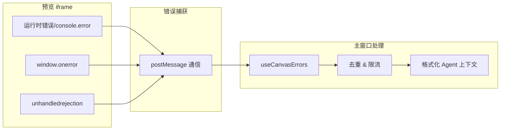
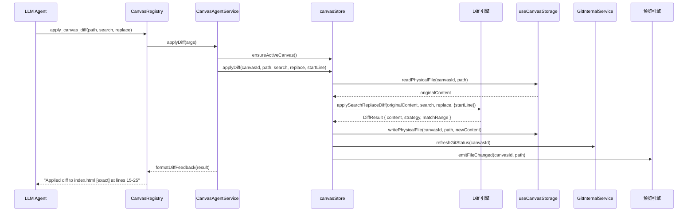
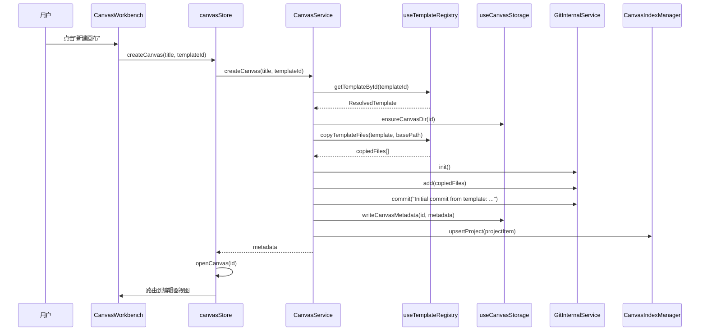
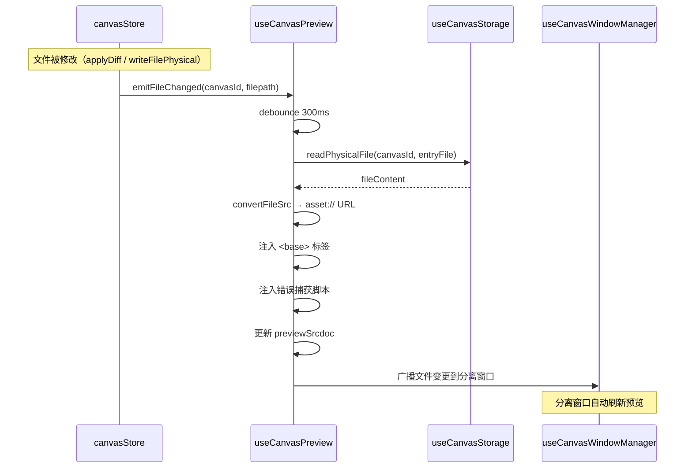

# Web Canvas: 架构与开发者指南 (v1)

本文档旨在深入解析 `web-canvas` 工具的内部架构、设计理念和数据流，为后续的开发和维护提供清晰的指引。

## 1. 核心概念 (Core Concepts)

`web-canvas` 是一个基于 **Physical-First** 架构的 Agent 协作画布工具。它不维护"影子文件"或内存中的虚拟文件系统，所有编辑操作**直接**作用于物理磁盘，利用 Git 进行版本追踪。

### 1.1. 画布项目 (Canvas Project)

每个画布项目是磁盘上的一个独立目录，同时也是**一个独立的 Git 仓库**。

- **标识**: 每个项目通过 `cp_{yyyyMMdd}_{shortId}` 格式的 ID 唯一标识，例如 `cp_20260315_aBcDeF`。
- **物理存储**: 项目存储在 `{appDataDir}/canvases/projects/{canvasId}/` 下。
- **生命周期**: 创建（从模板初始化）→ 编辑（直接读写物理文件）→ 提交（Git Commit）→ 删除（安全回收站）。

### 1.2. Physical-First 架构

与常见的"内存中编辑 → 统一保存"模式不同，web-canvas 采用**物理优先**策略：

```
用户编辑 → 直接写磁盘 → 更新 Git 状态追踪 → 触发预览刷新
```

- **无影子文件**: 所有文件操作（`applyDiff`、`writeFilePhysical`）立即写入物理文件。
- **即时可见**: 预览界面通过 `asset://` 协议直接加载磁盘上的文件，修改后刷新预览即可看到效果。
- **Git 作为状态追踪**: 通过 `isomorphic-git` 的 `statusMatrix` 实时获取文件的变更状态（`clean` / `modified` / `new` / `deleted`），而非维护独立的内存状态列表。
- **优势**:
  - 简化架构：无需处理影子文件与物理文件的同步问题。
  - 外部兼容：用户可以在 VSCode 等外部编辑器中修改文件，web-canvas 能通过 Git 状态自动感知变更。
  - 安全可靠：每一步操作都是持久化的，崩溃或重启不会丢失数据。

### 1.3. 模板系统 (Template System)

画布项目从模板初始化，模板决定了项目的初始文件结构和入口文件。

- **模板来源**:
  - **builtin**: 内置模板，随应用打包发布，存放在 Tauri 资源目录中。
  - **user**: 用户自定义模板，存放在 `{appDataDir}/canvases/templates/user/` 下。
- **模板生命周期**:
  1. **初始化**: 应用启动时，`useTemplateRegistry.initBuiltinTemplates()` 将内置模板从资源目录同步到 `AppData`。
  2. **版本管理**: 通过 `template.json` 中的 `version` 字段做版本比较，仅在版本更新时覆盖。
  3. **项目创建**: `CanvasService.createCanvas()` 从选中模板的 `files/` 目录递归复制文件到新项目目录。
  4. **Git 初始化**: 复制完成后自动执行 `git init` → `git add` → `git commit`。
- **模板包结构**:
  ```
  templates/{source}/{templateId}/
  ├── template.json          # 元数据（id, name, version, entryFile 等）
  ├── preview.png            # 缩略图（可选）
  └── files/                 # 项目初始文件
      ├── index.html
      ├── style.css
      └── ...
  ```

### 1.4. Git 版本控制 (Version Control)

每个画布项目是一个独立的 Git 仓库，使用 `isomorphic-git`（纯 JS 实现）在 Tauri 环境下运行。

- **核心服务**: `GitInternalService` 封装了所有 Git 操作，通过适配 Tauri 的 `fs` 插件提供符合 `isomorphic-git` 要求的 `fs` 接口。
- **状态追踪**: `statusMatrix` 返回 `[filepath, HEAD, WORKDIR, STAGE]` 矩阵，用于计算 `dirtyFiles` 状态。
- **操作支持**:
  - `init`: 初始化仓库
  - `add`: 暂存文件
  - `commit`: 提交变更
  - `checkout`: 回退文件到 HEAD
  - `log`: 查看提交历史
  - `statusMatrix`: 获取工作区状态
- **过滤规则**: `.git` 和 `.canvas.json` 不纳入版本控制。

### 1.5. Agent 集成 (Agent Integration)

web-canvas 通过 `web-canvas.registry.ts` 暴露了一套完整的 Agent 可调用方法，使其能够被 LLM Agent 驱动。

- **注册方式**: `CanvasRegistry` 实现了 `ToolRegistry` 接口，通过 `getMetadata()` 声明可调用方法。
- **Agent 可调用方法**:

| 方法名                 | 功能                             | 参数                                       |
| ---------------------- | -------------------------------- | ------------------------------------------ |
| `read_canvas_file`     | 读取文件（带行号）               | `path`                                     |
| `apply_canvas_diff`    | 应用 Search/Replace Diff         | `path`, `search`, `replace`, `start_line?` |
| `write_canvas_file`    | 写入完整文件内容（不存在则创建） | `path`, `content`                          |
| `commit_changes`       | 提交所有更改                     | `message?`                                 |
| `discard_changes`      | 丢弃未提交更改                   | -                                          |
| `list_canvas_files`    | 获取文件树                       | -                                          |
| `create_canvas`        | 创建新画布项目                   | `title`, `templateId?`                     |
| `clear_runtime_errors` | 清空运行时错误                   | `canvasId?`                                |

- **上下文注入**: `CanvasAgentService.getExtraPromptContext()` 为 Agent 提供当前画布的项目结构、文件树、未提交变更和运行时错误信息。
- **审批钩子**: `onToolCallPreview` 在 Agent 操作前先应用变更到磁盘，让用户在预览中实时确认效果。`onToolCallDiscarded` 在拒绝后根据文件状态执行回滚：若为新文件则物理删除，若为已有文件则通过 Git `checkout` 恢复。
- **隐式创建**: Agent 操作（如 `apply_canvas_diff`）在无活动画布时会通过 `ensureActiveCanvas()` 隐式创建一个新画布，确保协作流不中断。

### 1.6. 运行时错误捕获 (Runtime Error Capture)

web-canvas 通过在预览 `iframe` 中注入脚本，实时捕获前端的运行时错误。

- **捕获机制**: 注入的脚本劫持全部四种 `console` 方法（`log`/`info`/`warn`/`error`）、`window.onerror` 和 `unhandledrejection` 事件。所有消息均转发至主窗口控制台，但只有 `warn` 和 `error` 会被记录为运行时错误并注入 Agent 上下文。
- **错误状态管理**: `useCanvasErrors` 管理错误的添加、去重、过期标记和格式化。
- **Agent 集成**: 当开启 `autoIncludeErrors` 配置时，活跃的错误会自动注入到 Agent 上下文中，引导 LLM 修复问题。
- **过期机制**: 文件修改后错误被标记为 `stale`，预览刷新后自动清除过期错误。



### 1.7. 预览引擎 (Preview Engine)

预览引擎负责在 `iframe` 中渲染画布的入口文件（通常是 `index.html`）。

- **核心 Composable**: `useCanvasPreview`
- **工作原理**:
  1. 读取项目目录下的入口文件内容。
  2. 使用 Tauri 的 `convertFileSrc` 将物理路径转换为 `asset://` URL。
  3. 在 HTML 的 `<head>` 中注入 `<base>` 标签（确保相对路径资源正确加载）。
  4. 注入控制台捕获和错误监听脚本。
  5. 使用 `srcdoc` 属性渲染到 `iframe` 中。
- **防抖刷新**: `refreshPreview` 使用 `debounce(300ms)` 防止频繁的文件变更导致过度刷新。
- **Console 消息**: 通过 `postMessage` 实现 `iframe` 与主窗口的控制台消息双向通信。

### 1.8. 跨窗口同步 (Cross-window Sync)

web-canvas 支持将预览窗口分离为独立窗口，通过状态同步引擎保持数据一致。

- **主从架构**:
  - **主窗口（Main）**: 唯一的状态真实来源，管理所有业务逻辑。
  - **预览窗口（Detached）**: 仅负责渲染预览，通过 `useCanvasStateConsumer` 同步状态。
- **同步内容**: 当前 `activeCanvasId` 和文件变更通知。
- **操作代理**: 分离窗口的操作（如写文件、提交）通过 `bus.onActionRequest` 发送到主窗口执行。

## 2. 存储架构 (Storage Architecture)

### 2.1. 物理存储布局

```
{appDataDir}/canvases/
├── projects.json                    # 项目索引文件
├── templates/
│   ├── builtin/                     # 内置模板（从资源同步）
│   │   ├── blank-html/
│   │   │   ├── template.json
│   │   │   └── files/
│   │   │       ├── index.html
│   │   │       └── style.css
│   │   └── ...
│   └── user/                        # 用户自定义模板
│       └── ...
└── projects/
    └── cp_20260315_aBcDeF/          # 画布项目目录
        ├── .canvas.json             # 画布元数据
        ├── .git/                    # Git 仓库
        ├── index.html
        ├── style.css
        └── script.js
```

### 2.2. 项目索引 (projects.json)

索引文件位于 `{appDataDir}/canvases/projects.json`，用于快速加载项目列表，避免读取每个项目的元数据文件。

```typescript
interface CanvasIndex {
  version: string; // 索引版本
  lastUpdated: number; // 最后更新时间
  projects: CanvasIndexItem[];
}

interface CanvasIndexItem {
  id: string; // 画布 ID
  name: string; // 项目名称
  description?: string;
  createdAt: number;
  updatedAt: number;
  relPath: string; // "projects/cp_xxx"
  fileCount?: number;
  previewUrl?: string;
}
```

- **原子写入**: 索引文件通过先写临时文件再重命名的方式保证写入的原子性。
- **版本控制**: 索引与元数据分离，索引损坏时可以通过 `repairProject` 执行 `"remove_index"`（移除索引）、`"reindex"`（从元数据重建）或 `"restore_metadata"`（从索引恢复元数据）进行修复。

### 2.3. 画布元数据 (.canvas.json)

每个项目目录下都有一个 `.canvas.json` 文件，存储项目的完整元数据：

```typescript
interface CanvasMetadata {
  id: string; // 唯一标识
  name: string; // 项目名称
  description?: string;
  createdAt: number;
  updatedAt: number;
  tags?: string[];
  basePath: string; // 相对于 canvases/projects/ 的路径
  previewUrl?: string; // 预览图路径
  entryFile: string; // 入口文件，默认 'index.html'
  template?: string; // 使用的模板 ID
  fileCount?: number;
  lastOpenedFile?: string;
  config?: Record<string, any>;
}
```

## 3. 架构概览

本模块遵循关注点分离原则，将状态、业务逻辑、数据访问和 UI 清晰地分离。

### 3.1. 分层架构

```mermaid
graph TD
    subgraph UI Layer[UI 层 - Vue Components]
        CanvasWorkbench
        CanvasEditorPanel
        CanvasProjectList
        CanvasWindow
        CanvasWindowContainer
        CreateCanvasDialog
        CanvasMonacoEditor
        CanvasSettings
    end

    subgraph State Layer[状态层 - Pinia Store]
        canvasStore
    end

    subgraph Logic Layer[逻辑层 - Composables]
        useCanvasStorage
        useCanvasPreview
        useCanvasErrors
        useCanvasSync
        useCanvasWindowManager
        useCanvasStateConsumer
        useTemplateRegistry
    end

    subgraph Service Layer[服务层 - Services]
        CanvasService
        CanvasAgentService
        CanvasIndexManager
        GitInternalService
        VSCodeDetector
    end

    subgraph Resource Layer[资源层 - Tauri API & 物理文件]
        PhysicalFiles[物理文件系统]
        GitRepo[Git 仓库]
    end

    UI Layer --> State Layer
    UI Layer --> Logic Layer
    State Layer --> Service Layer
    State Layer --> Logic Layer
    Service Layer --> Resource Layer
    Logic Layer --> Resource Layer
```

### 3.2. 核心角色与职责

#### 3.2.1. Pinia Store: `canvasStore`

**核心业务状态的中心管理者**。负责所有画布 CRUD 操作、文件编辑、Git 操作和预览窗口调用的编排。

- **状态**:
  - `canvasList`: 画布列表
  - `activeCanvasId`: 当前激活的画布 ID
  - `activeFile`: 当前编辑的文件路径
  - `dirtyFiles`: 未提交变更的文件状态 Map
  - `config`: 用户配置（持久化到 localStorage）
- **职责**:
  - 协调 `CanvasService`、`CanvasIndexManager`、`GitInternalService`、`useCanvasStorage` 等模块。
  - 提供高级操作 API（如 `applyDiff`、`commitChanges`、`discardChanges`）。
  - 维护文件变更事件系统，通知同步引擎和预览模块。
  - 转发 `useCanvasErrors` 子模块的错误管理能力。

#### 3.2.2. `useCanvasStorage` (存储抽象层)

**纯物理文件操作的封装**。不包含任何业务逻辑，只负责与文件系统交互。

- **能力**: 读写物理文件、读写元数据、获取文件树、删除画布。
- **文件树**: 调用 Rust 后端指令 `generate_directory_tree` 获取高性能目录树，然后过滤 `.git` / `.canvas.json` 并转为 `CanvasFileNode`。

#### 3.2.3. `CanvasService` (核心业务逻辑)

**业务编排者**。负责创建画布、健康检查和项目修复。

- **创建流程**:
  1. 调用 `useTemplateRegistry` 获取模板
  2. 调用 `useCanvasStorage` 创建目录
  3. 调用 `useTemplateRegistry.copyTemplateFiles` 复制初始文件
  4. 调用 `GitInternalService` 初始化 Git 并做首次提交
  5. 写入元数据并更新索引
- **健康检查**: 对比磁盘目录和索引，识别 `missing`（索引有磁盘无）和 `unindexed`（磁盘有索引无）的项目。

#### 3.2.4. `CanvasAgentService` (Agent 交互层)

**Agent 与画布之间的桥梁**。负责组装 Prompt 上下文、格式化工具体响应、处理审批钩子。

- 不直接操作 Store，而是通过 Store 提供的 API 进行调用。
- `onToolCallPreview` 在审批前**直接执行**变更（applyDiff / writeFile），让用户能在预览中看到效果再做决定。
- `onToolCallDiscarded` 在拒绝后通过 Git `checkout` 或物理删除来回滚变更。

#### 3.2.5. `GitInternalService` (版本控制引擎)

**isomorphic-git 的 Tauri 适配层**。提供符合 `isomorphic-git` 要求的 `fs` 接口，封装所有 Git 操作。

- **关键适配**: 将 Tauri 的 `fs` 插件 API（`readFile`、`writeFile`、`mkdir`、`remove`、`stat`、`readDir`）映射为 `isomorphic-git` 所需的 Node.js 风格 fs promises 接口。
- **ENOENT 处理**: 封装 `wrapENOENT`，将 Tauri 的错误信息转换为 Node.js 兼容的 `ENOENT` 错误码。

#### 3.2.6. `CanvasIndexManager` (索引管理器)

**单例模式**的项目索引管理器。负责维护 `projects.json` 的读写和增删改。

- **单例实现**: 使用 `getInstance()` 静态方法确保全局唯一。
- **惰性路径解析**: `indexPath` 在首次调用时异步解析，避免构造时的 `await` 问题。

## 4. 数据流 (Data Flow)

### 4.1. Agent 操作文件编辑流

当 Agent 调用 `apply_canvas_diff` 时：



### 4.2. 画布创建流



### 4.3. 预览刷新流



## 5. Diff 引擎 (Diff Engine)

Diff 引擎是 `web-canvas` 工具的核心技术之一，它实现了与 AI 编辑器类似的 **Search/Replace** 代码修改模式。

### 5.1. 匹配策略

引擎采用**降级匹配策略**，从精确到模糊逐步尝试：

```
exact → trimEnd → trim → fuzzy → 抛出异常
```

| 策略      | 描述                            | 置信度   |
| --------- | ------------------------------- | -------- |
| `exact`   | 字符串精确匹配                  | 1.0      |
| `trimEnd` | 忽略末尾空白后逐行匹配          | 1.0      |
| `trim`    | 完全忽略所有空白（缩进不敏感）  | 1.0      |
| `fuzzy`   | Bigram Dice 相似度匹配（≥0.85） | 0.85~1.0 |

### 5.2. 关键特性

- **行号剥离**: 自动移除 `search` 内容中的行号前缀（支持 `[空白]数字 | 内容` 格式），允许 Agent 直接使用从编辑器复制的带行号代码。
- **行号提示**: 支持 `startLine` 参数，在存在多个匹配时优先选择靠近指定行号的匹配，用于消歧义。
- **重匹配检测**: 检测 `search` 在文件中的重复次数，若存在多处匹配则提供消歧义警告。
- **缩进修复**: 当使用逐行匹配策略（`trimEnd`/`trim`）时，自动将 `replace` 的缩进调整为与原始代码匹配，确保代码风格一致。
- **模糊匹配阈值**: 0.75~0.85 之间的匹配视为"候选"，抛出 `DiffFuzzyMatchError` 供调用方确认；低于 0.75 返回完全失败。

### 5.3. 相似度算法

使用 **Bigram Dice Coefficient**（双字母组骰子系数）计算字符串相似度：

```text
similarity = 2 * |intersection(bigrams(A), bigrams(B))| / (|bigrams(A)| + |bigrams(B)|)
```

- 首尾行加权（权重 1.2），确保关键上下文行匹配更准确。
- 纯函数实现，零依赖，适合在 Tauri 环境下运行。

## 6. 关键类型定义 (Key Types)

### 6.1. 画布相关

- **`CanvasMetadata`**: 画布元数据，存储在 `.canvas.json`。
  - `id`, `name`, `description`, `createdAt`, `updatedAt`: 基础信息。
  - `basePath`: 项目目录（相对路径）。
  - `entryFile`: 项目入口文件（默认 `index.html`），预览引擎使用。
  - `template`: 创建时使用的模板 ID。

- **`CanvasListItem`**: 画布列表项，用于项目大厅展示。
  - `metadata`: `CanvasMetadata`。
  - `status`: `"idle" | "open" | "dirty" | "syncing"`。
  - `dirtyFileCount`: 未提交更改的文件数。
  - `health`: `"healthy" | "missing" | "unindexed" | "corrupted"`（健康检查结果）。

- **`CanvasFileNode`**: 文件树节点。
  - `name`, `path`, `isDirectory`, `children`: 目录树结构。
  - `size`: 文件大小。
  - `status`: `"clean" | "modified" | "new" | "deleted"`（来自 Git 状态）。

### 6.2. Diff 相关

- **`DiffOptions`**: Diff 可选参数。
  - `startLine?`: 提示搜索起始行号（1-based），用于匹配消歧义。

- **`DiffResult`**: Diff 应用结果。
  - `content`: 替换后的完整文件内容。
  - `strategy`: 匹配策略（`exact | trimEnd | trim | fuzzy`）。
  - `confidence`: 匹配置信度（0~1）。
  - `matchRange`: `[startLine, endLine]`（1-based）。
  - `duplicateCount`: 搜索匹配的总次数。
  - `warnings`: 警告信息（如重匹配提醒）。

- **`DiffFuzzyMatchError`**: 模糊匹配失败的异常，包含最佳候选的 `confidence`、`lineRange` 和 `preview`。

### 6.3. 模板相关

- **`CanvasTemplateDef`**: 模板清单定义（对应 `template.json`）。
  - `id`, `name`, `description`, `version`, `category`: 基础信息。
  - `entryFile`: 项目入口文件。
  - `preview?`: 缩略图路径。

- **`ResolvedTemplate`**: 运行时使用的模板对象。
  - 继承 `CanvasTemplateDef`。
  - `source`: `"builtin" | "user"`。
  - `bundlePath`: 模板包绝对路径。
  - `filesPath`: `files/` 目录绝对路径。
  - `previewPath?`: 缩略图绝对路径。

### 6.4. 运行时错误

- **`RuntimeError`**: 运行时错误对象。
  - `id`: 唯一标识。
  - `canvasId`, `level`, `message`: 基础信息。
  - `filename?`, `lineno?`, `colno?`: 错误位置。
  - `stack?`: 堆栈信息。
  - `stale`: 是否过期（文件修改后标记）。

### 6.5. 配置

- **`CanvasConfig`**: 画布用户配置。
  - `maxRuntimeErrors`: 最大错误数（默认 10）。
  - `autoIncludeErrors`: 自动包含运行时错误到 Agent 上下文。
  - `autoOpenPreview`: 创建/打开项目时自动开启预览窗口。
  - `previewRefreshDelay`: 预览刷新延迟（默认 500ms）。
  - `fontSize`, `wordWrap`: 编辑器偏好。
  - `defaultTemplate`: 默认模板 ID（`"blank-html"`）。
  - `vscodePath?`: VSCode 路径。

## 7. 配置体系 (Configuration System)

web-canvas 的设置系统采用声明式配置，与应用的设置渲染器集成。

### 7.1. 配置分区

| 分区       | 说明                           |
| ---------- | ------------------------------ |
| 预览与行为 | 自动打开预览、预览刷新延迟     |
| Agent 协作 | 自动包含运行时错误、最大错误数 |
| 编辑器设置 | 字体大小、自动换行             |
| 外部编辑器 | VSCode 路径                    |
| 项目管理   | 默认项目模板                   |

### 7.2. 配置持久化

- 用户配置通过 `useLocalStorage<CanvasConfig>("aio-canvas-config", DEFAULT_CANVAS_CONFIG)` 持久化到 `localStorage`。
- 每个项目的 `template` 和 `entryFile` 等配置存储在项目的 `.canvas.json` 中。
- 项目索引存储在 `AppData/canvases/projects.json` 中。

## 8. 数据持久化 (Data Persistence)

web-canvas 采用**多级存储策略**，将索引、元数据和项目文件分层存储：

| 数据类型   | 存储位置                         | 格式     | 读写时机                       |
| ---------- | -------------------------------- | -------- | ------------------------------ |
| 项目索引   | `AppData/canvases/projects.json` | JSON     | 启动时加载列表，增删改时更新   |
| 画布元数据 | `projects/{id}/.canvas.json`     | JSON     | 打开画布时读取，修改信息时写入 |
| 项目文件   | `projects/{id}/`                 | 物理文件 | 编辑操作时直接读写             |
| Git 仓库   | `projects/{id}/.git/`            | Git      | 通过 isomorphic-git 操作       |
| 用户配置   | `localStorage`                   | JSON     | 按需读取                       |
| 物理文件   | 直接文件系统                     | -        | 直接操作                       |
