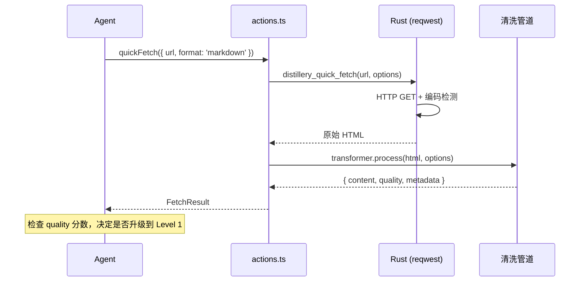
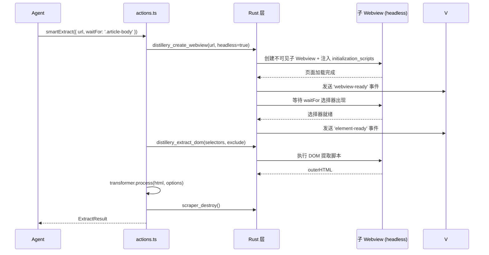
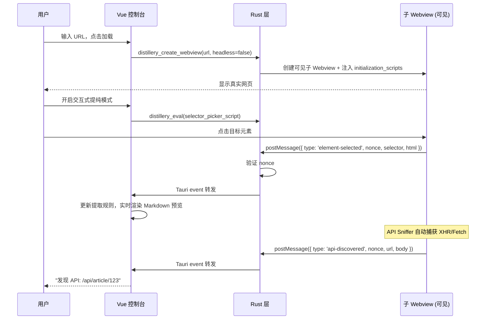

# Web Distillery (网页蒸馏室)

## 1. 设计哲学：AIO 的网页内容获取方案

AIO 目前没有 UrlFetch 类工具。Web Distillery 就是 AIO 唯一的网页内容获取入口——不是做一个简单粗暴的 HTTP 请求器，而是一个**分层的、高纯度的**内容提炼方案。

核心理念：

- **分层 API**：从轻量 HTTP 请求到完整浏览器操控，提供不同层级的“蒸馏”强度，让 Agent 自己根据目标网页复杂度决定
- **纯度优先**：拿到 HTML 只是“粗盐”，清洗、提纯成干净可用的 Markdown 才是最终产出的“精盐”
- **真实浏览器**：Tauri 2.0 底层基于 WRY（WebView Rendering Library），Windows 上是 WebView2 (Chromium)，macOS 上是 WKWebView，Linux 上是 WebKitGTK——不是模拟，是操控

---

## 2. 分层 Agent API 设计

这是整个工具的核心设计。Agent 面对一个 URL 时，有三个层级可选，从轻到重：

### 2.1 Level 0: Quick Fetch（轻量请求）

**不启动 Webview**，Rust 端直接用 `reqwest` 发 HTTP 请求。

```
Agent 调用 → Rust reqwest → HTML/JSON → 清洗管道 → 返回结果
```

适用场景：

- 静态页面、博客文章
- REST API / JSON 接口
- RSS / Atom Feed
- 不需要 JS 渲染的内容

优势：速度快（毫秒级）、资源消耗低、可并发批量请求。

```typescript
// actions.ts - Level 0
async function quickFetch(options: {
  url: string;
  format?: "markdown" | "text" | "html" | "json"; // 期望的输出格式
  headers?: Record<string, string>; // 自定义请求头
  cookieProfile?: string; // 使用已保存的身份卡片
  timeout?: number; // 超时（ms），默认 15000
  extractSelectors?: string[]; // 指定提取的 CSS 选择器（不指定则自动提取正文）
}): Promise<FetchResult>;
```

**Agent 判断依据**：URL 看起来是静态内容、API 端点、或者没有明确需要 JS 渲染的理由时，先用 Level 0 试。如果返回结果的 `quality` 分数低或内容明显不完整，再升级到 Level 1。

### 2.2 Level 1: Smart Extract（智能提取）

**启动子 Webview**，等待 JS 渲染完成，自动提取正文。Agent 无需人工介入。

```
Agent 调用 → 创建子 Webview → 导航 → 等待渲染 → 自动提取正文 → 清洗管道 → 销毁 Webview → 返回结果
```

适用场景：

- SPA / CSR 页面（React、Vue 渲染的内容）
- 需要 JS 执行才能加载的动态内容
- Level 0 拿到的内容质量差或不完整时的自动升级
- 需要登录态（配合 Cookie Profile）的页面

```typescript
// actions.ts - Level 1
async function smartExtract(options: {
  url: string;
  format?: "markdown" | "text" | "html";
  cookieProfile?: string; // 使用已保存的身份卡片
  waitFor?: string; // CSS 选择器，等该元素出现后再提取
  waitTimeout?: number; // 等待超时（ms），默认 10000
  timeout?: number; // 总超时（ms），默认 30000
  extractSelectors?: string[]; // 指定提取的 CSS 选择器
  excludeSelectors?: string[]; // 排除的 CSS 选择器
  includeImages?: boolean; // 是否本地化图片，默认 false
  enableApiSniffer?: boolean; // 是否启用 API 嗅探，默认 false
}): Promise<ExtractResult>;
```

**Agent 判断依据**：已知目标是 SPA 页面、或 Level 0 返回的 `quality` 低、或需要登录态时使用。

### 2.3 Level 2: Interactive Distillation（交互式提纯/手术模式）

**完整的交互式 UI**。Agent 不直接调用此模式，而是引导用户打开 Web Distillery 界面手动操作。此模式下提供“手术刀”工具，用于精确切除干扰元素。

适用场景：

- 复杂页面结构，自动蒸馏效果不好
- 需要用户手动选择元素、配置精确的提炼规则
- 需要反复调试提取策略的场景
- 需要 API Sniffer 发现隐藏接口

```typescript
// actions.ts - Level 2（辅助方法）
async function openDistillery(options?: {
  url?: string; // 预填 URL
  cookieProfile?: string; // 预选身份卡片
}): Promise<void>; // 打开 UI，不返回内容（用户在 UI 中操作）
```

### 2.4 返回类型定义

```typescript
interface FetchResult {
  url: string;
  title: string;
  content: string; // 清洗后的内容（格式由 format 参数决定）
  contentLength: number; // 内容字符数
  format: "markdown" | "text" | "html" | "json";
  quality: number; // 0-1 提取质量估计
  level: 0 | 1; // 实际使用的获取层级
  fetchedAt: string; // ISO 时间戳
  metadata?: {
    description?: string; // <meta description>
    author?: string;
    publishDate?: string;
    language?: string;
  };
  warnings?: string[]; // 提取过程中的警告（如"检测到反爬拦截"、"内容可能不完整"）
}

interface ExtractResult extends FetchResult {
  images?: AssetRef[]; // 本地化后的图片引用
  discoveredApis?: ApiInfo[]; // Sniffer 发现的接口（仅 enableApiSniffer=true 时）
  domSnapshot?: string; // 冻结的 DOM 快照（可选）
}

interface ApiInfo {
  url: string;
  method: string;
  contentType: string;
  bodyPreview: string; // 前 2000 字符
  isJson: boolean;
}
```

### 2.5 错误分类

Agent 需要根据错误类型决定是否重试或升级层级：

```typescript
type FetchErrorCode =
  | "NETWORK_ERROR" // 网络不可达
  | "TIMEOUT" // 超时
  | "HTTP_ERROR" // HTTP 4xx/5xx
  | "ANTI_CRAWL" // 检测到反爬拦截（403 + 特征页面）
  | "EMPTY_CONTENT" // 页面加载成功但提取到的内容为空
  | "LOW_QUALITY" // 提取成功但质量分数过低
  | "COOKIE_EXPIRED" // Cookie Profile 已过期
  | "SELECTOR_NOT_FOUND" // 指定的 CSS 选择器未匹配到元素
  | "WEBVIEW_CRASH"; // 子 Webview 崩溃
```

**升级策略建议**（写入 Agent metadata description，供 Agent 参考）：

| 错误码           | 建议动作                                                |
| :--------------- | :------------------------------------------------------ |
| `ANTI_CRAWL`     | 升级到 Level 1（真实浏览器指纹），或配合 Cookie Profile |
| `EMPTY_CONTENT`  | 升级到 Level 1（可能需要 JS 渲染）                      |
| `LOW_QUALITY`    | 升级到 Level 1，或指定 `extractSelectors`               |
| `COOKIE_EXPIRED` | 提示用户重新登录（引导到 Level 2）                      |

### 2.6 Registry 注册规范

遵循 AIO 的 `ToolRegistry` 接口规范，采用 Facade 模式封装 Agent 调用：

```typescript
// webDistillery.registry.ts
export default class WebDistilleryRegistry implements ToolRegistry {
  public readonly id = "web-distillery";
  public readonly name = "网页蒸馏室";

  // Agent Facade：处理参数转换
  public async quickFetch(args: Record<string, unknown>): Promise<FetchResult> {
    return await quickFetch({
      url: String(args.url),
      format: (args.format as any) || "markdown",
      cookieProfile: args.cookieProfile ? String(args.cookieProfile) : undefined,
    });
  }

  public getMetadata(): ServiceMetadata {
    return {
      methods: [
        {
          name: "quickFetch",
          displayName: "快速获取网页内容",
          description: "轻量级 HTTP 请求。适用于静态页面、API、RSS 等。速度快、资源消耗低。",
          agentCallable: true,
          parameters: [
            { name: "url", type: "string", description: "目标 URL", required: true },
            { name: "format", type: "'markdown' | 'text' | 'html' | 'json'", defaultValue: "markdown" },
          ],
          returnType: "Promise<FetchResult>",
        },
        {
          name: "smartExtract",
          displayName: "智能提取网页内容",
          description: "启动真实浏览器渲染页面。适用于 SPA、动态内容、需要登录的页面。",
          agentCallable: true,
          parameters: [
            { name: "url", type: "string", description: "目标 URL", required: true },
            { name: "waitFor", type: "string", description: "等待元素出现的选择器" },
          ],
          returnType: "Promise<ExtractResult>",
        },
      ],
    };
  }
}

export const toolConfig: ToolConfig = {
  name: "网页蒸馏室",
  path: "/web-distillery",
  icon: markRaw(GlassWater),
  component: () => import("./WebDistillery.vue"),
  category: "AI 工具",
};
```

---

## 3. 内容清洗管道

这是整个工具最终交付价值的出口。拿到 HTML 只是第一步，清洗成干净可用的内容才是关键。

### 3.1 管道架构

清洗是多阶段 pipeline，每个阶段职责明确：

```
原始 HTML
  ↓ Stage 1: 预处理（编码检测、DOM 解析）
  ↓ Stage 2: 去噪（移除广告/导航/页脚等干扰元素）
  ↓ Stage 3: 正文提取（Readability 算法 + 选择器匹配）
  ↓ Stage 4: 结构转换（HTML → 目标格式）
  ↓ Stage 5: 后处理（图片本地化、链接修正、质量评估）
清洗后的内容
```

### 3.2 各阶段详细设计

**Stage 1: 预处理**

| 职责     | 实现                                                                                     |
| :------- | :--------------------------------------------------------------------------------------- |
| 编码检测 | 检查 `<meta charset>` 和 HTTP `Content-Type`，非 UTF-8 页面（GBK、Shift_JIS 等）自动转码 |
| DOM 解析 | 统一在 TypeScript 端使用 DOMParser (Level 2) 或 linkedom (Level 0/1) 解析                |
| 基础清理 | 移除 `<script>`、`<style>`、`<noscript>`、HTML 注释                                      |

**Stage 2: 去噪**

采用**启发式规则 + Readability 算法**双轨策略：

- **启发式规则**：基于常见模式识别干扰元素
  - 语义标签：`<nav>`, `<header>`, `<footer>`, `<aside>`
  - 常见 class/id 模式：`sidebar`, `nav`, `menu`, `ad`, `banner`, `comment`, `related`, `share`, `social`
  - 隐藏元素：`display:none`, `visibility:hidden`, `aria-hidden="true"`
- **Readability 算法**：基于 Mozilla Readability 的文本密度分析，计算每个节点的"内容得分"，保留得分最高的主体区域
- **用户自定义排除**：通过 `excludeSelectors` 参数手动排除特定元素

**Stage 3: 正文提取**

- 如果指定了 `extractSelectors`：直接按选择器提取，跳过自动识别
- 如果未指定：使用 Readability 算法自动识别正文区域
- 提取 `<title>` 和 `<meta>` 信息填充 metadata

**Stage 4: 结构转换**

HTML → Markdown 转换需要处理的复杂结构：

| HTML 结构             | Markdown 处理策略                 |
| :-------------------- | :-------------------------------- |
| `<table>`             | 转为 GFM 表格，超宽表格降级为列表 |
| `<pre><code>`         | 保留代码块，尝试识别语言          |
| 嵌套列表              | 保持层级缩进                      |
| `<details>`           | 转为引用块 + 标题                 |
| ``               | ``，可选本地化         |
| `<video>`, `<iframe>` | 保留为链接 `[视频: title](src)`   |
| `<svg>`               | 跳过（无法转为 Markdown）         |
| `<math>` / KaTeX      | 保留 LaTeX 源码                   |

**Stage 5: 后处理**

- **图片本地化**（可选）：下载图片到 AppData 资产库，替换为 `appdata://` 协议路径
- **链接修正**：相对路径转绝对路径
- **空白清理**：合并连续空行、修剪首尾空白
- **质量评估**：计算 `quality` 分数（0-1），基于以下指标：
  - 内容长度（过短可能提取不完整）
  - 文本/标签比（过低可能是模板页面）
  - 是否包含有意义的段落结构
  - 是否检测到反爬特征（如"请完成验证"、"请登录后查看"）

### 3.3 分页内容合并

对于分页文章（URL 中包含 `page=2` 或页面内有"下一页"链接），v1 暂不自动合并，但在 `warnings` 中提示"检测到分页，当前仅提取第 1 页"。v2 考虑自动翻页合并。

### 3.4 文件结构

```
src/tools/web-distillery/core/
├── transformer.ts               # 管道入口，编排各阶段
├── stages/
│   ├── preprocessor.ts          # Stage 1: 预处理
│   ├── denoiser.ts              # Stage 2: 去噪
│   ├── extractor.ts             # Stage 3: 正文提取
│   ├── converter.ts             # Stage 4: 结构转换（HTML → MD/Text）
│   └── postprocessor.ts         # Stage 5: 后处理
├── readability.ts               # Readability 算法实现
└── linkedom.ts                  # Node/Bun 环境下的 DOM 仿真层
```

---

## 4. 核心黑科技（Webview 操控层）

以下是 Level 1 和 Level 2 共用的底层能力。

### 4.1 原生子 Webview 嵌入 (Level 1/2 共用)

Tauri 2.0 的 `WebviewBuilder` 支持在同一个窗口中创建多个 Webview。我们在主窗口的左侧区域嵌入一个子 Webview，它加载目标网页。

```
主窗口 (Vue UI)
├── 顶部工具栏 (地址栏、Cookie Lab、提纯模式开关)
├── 左侧: 子 Webview (原生浏览器引擎，加载目标网页)
└── 右侧: 蒸馏控制台 (Vue 组件，规则、预览、API 列表)
```

子 Webview 的位置和尺寸由 Vue 端通过 IPC 实时同步给 Rust 端，响应布局变化。

**Level 1 的无头模式**：Agent 调用 `smartExtract` 时，子 Webview 创建在不可见区域（bounds 设为 0x0 或屏幕外），完成提取后自动销毁。用户无感知。

### 4.2 底层 Cookie 实验室

通过 Rust 端调用平台特定 API，实现对 Cookie 的完整控制：

| 平台    | API                          | 能力                   |
| ------- | ---------------------------- | ---------------------- |
| Windows | `ICoreWebView2CookieManager` | 读取、写入、删除、枚举 |
| macOS   | `WKHTTPCookieStore`          | 读取、写入、删除       |
| Linux   | `WebKitCookieManager`        | 读取、写入、删除       |

**工作流**：

1. 用户在子 Webview 中正常登录网站
2. 点击"🍪 提取 Cookie"，Rust 端通过平台 API 读取所有 Cookie
3. 保存为"身份卡片"（Profile），下次一键注入，无需重新登录
4. 支持从浏览器 DevTools 粘贴 Cookie 字符串，自动解析并注入

> ⚠️ **v1 现实与 Workaround**：WRY 对 Cookie 管理的高层封装目前不完整。v1 先用注入脚本 `document.cookie` 实现，**无法获取 HttpOnly Cookie**——而绝大多数认证 Cookie 都是 HttpOnly 的。这意味着 v1 的自动提取功能对登录态场景基本残废。
>
> **v1 Workaround**：在 Cookie Lab UI 中提供"手动粘贴"入口，用户从浏览器 DevTools → Application → Cookies 中复制完整 Cookie 字符串（包含 HttpOnly），粘贴后自动解析并保存为身份卡片。Level 0 的 `quickFetch` 可以直接在 HTTP 请求头中携带这些 Cookie。
>
> **v2 目标**：通过 `webview2-com` (Win), `cocoa` (mac), `webkit2gtk` (Linux) 实现完整的底层 Cookie API。

### 4.3 DOM 手术刀（Interactive Inspect，Level 2 专属）

开启交互模式后，通过 `webview.eval()` 向目标网页注入一段 Shadow DOM 隔离的覆盖层脚本，允许用户像使用手术刀一样精确划定或切除内容：

```javascript
// 注入到目标网页（Shadow DOM 隔离，不影响原网页样式）
// 1. 监听 mouseover，高亮悬停元素（显示 CSS 路径）
// 2. 监听 click，捕获选中元素，通过 postMessage 发送给 Rust 层
// 3. 支持"删除模式"：点击即从 DOM 中移除该节点（实时看到效果）
// 4. 支持"提取模式"：点击即将该节点的 outerHTML 加入提取清单
```

**智能路径推断**：

- 点击一个列表项 → 自动识别所有同类兄弟节点 → 生成通用选择器
- 点击两个相似元素 → 计算最近公共祖先 → 推断提取模式

### 4.4 网络嗅探器（API Sniffer）

通过 `initialization_scripts` 在页面 JS 执行前注入 Hook，拦截 `XMLHttpRequest`、`fetch`、`WebSocket` 和 `EventSource`：

```javascript
// 通过 initialization_scripts 注入（在任何页面 JS 之前执行）

// === fetch Hook ===
const _fetch = window.fetch;
window.fetch = async (input, init) => {
  const res = await _fetch(input, init);
  const clone = res.clone();
  clone.text().then((body) => {
    __DISTILLERY_BRIDGE__.send({
      type: "api-discovered",
      protocol: "fetch",
      url: typeof input === "string" ? input : input.url,
      method: init?.method || "GET",
      contentType: clone.headers.get("content-type") || "",
      bodyPreview: body.slice(0, 2000),
    });
  });
  return res;
};

// === XMLHttpRequest Hook ===
const _XHROpen = XMLHttpRequest.prototype.open;
const _XHRSend = XMLHttpRequest.prototype.send;
XMLHttpRequest.prototype.open = function (method, url, ...args) {
  this.__scraper_meta = { method, url };
  return _XHROpen.call(this, method, url, ...args);
};
XMLHttpRequest.prototype.send = function (body) {
  this.addEventListener("load", () => {
    __DISTILLERY_BRIDGE__.send({
      type: "api-discovered",
      protocol: "xhr",
      url: this.__scraper_meta.url,
      method: this.__scraper_meta.method,
      contentType: this.getResponseHeader("content-type") || "",
      bodyPreview: (this.responseText || "").slice(0, 2000),
    });
  });
  return _XHRSend.call(this, body);
};
```

当发现 JSON 接口时，右侧面板会提示："发现 API：`/api/article/123`，数据更完整，要直接爬接口吗？"

---

## 5. 通信链路与安全

### 5.1 postMessage 方案 + 平台统一封装

**核心问题**：子 Webview 加载的是外部 URL，Tauri 的 IPC 桥（`__TAURI_INTERNALS__`）**不会**注入到子 Webview 中。

**解决方案**：

```
子 Webview 注入脚本
    ↓ __DISTILLERY_BRIDGE__.send(data)  [统一封装]
Rust 端
    ↓ 监听 WebMessageReceived 事件
    ↓ 验证 nonce → 解析 JSON → 转发给主 Webview
主 Webview (Vue)
    ↓ 通过 Tauri event 接收
    ↓ 更新 Store，触发 UI 响应
```

**bridge.js 的平台统一封装**：

```javascript
// inject/bridge.js - initialization_script
// Rust 端在注入前会替换 __NONCE_PLACEHOLDER__ 为随机 nonce
(function () {
  const NONCE = "__NONCE_PLACEHOLDER__";

  // 平台检测 + 统一发送接口
  const postMessage = (function () {
    // Windows (WebView2/Chromium)
    if (window.chrome && window.chrome.webview) {
      return (data) => window.chrome.webview.postMessage(data);
    }
    // macOS (WKWebView)
    if (window.webkit && window.webkit.messageHandlers && window.webkit.messageHandlers.ipc) {
      return (data) => window.webkit.messageHandlers.ipc.postMessage(data);
    }
    // Linux (WebKitGTK) - 使用 document.title hack 或其他方式
    // Linux (WebKitGTK)
    if (window.webkit && window.webkit.messageHandlers && window.webkit.messageHandlers.ipc) {
      return (data) => window.webkit.messageHandlers.ipc.postMessage(data);
    }
    return (data) => console.warn("No IPC handler found", data);
  })();

  window.__DISTILLERY_BRIDGE__ = {
    send(payload) {
      postMessage(JSON.stringify({ nonce: NONCE, ...payload }));
    },
  };
})();
```

### 5.2 消息安全：Nonce 验证

**问题**：目标网页的 JS 能访问到 `window.chrome.webview.postMessage`（这是 WebView2 的原生 API），恶意页面可以伪造 `{ type: 'element-selected' }` 消息。

**解决方案**：Rust 端在创建子 Webview 时生成一个随机 nonce，通过字符串替换注入到 bridge.js 中。所有合法消息必须携带这个 nonce，Rust 端在 `on_message` 回调中验证 nonce 后才转发。

```rust
// webview.rs
let nonce = uuid::Uuid::new_v4().to_string();
let bridge_script = include_str!("inject/bridge.js")
    .replace("__NONCE_PLACEHOLDER__", &nonce);

// on_message 回调中
if msg.nonce != expected_nonce {
    log::warn!("收到伪造消息，丢弃");
    return;
}
```

### 5.3 注入时机：initialization_scripts

**核心问题**：普通 `eval()` 注入发生在页面 JS 已经执行之后。SPA 框架会在模块加载阶段缓存原始 `fetch` 引用，后续 Hook 无效。

**解决方案**：使用 WRY 的 `initialization_scripts` 配置（对应 WebView2 的 `AddScriptToExecuteOnDocumentCreated`），保证 Hook 脚本在任何页面 JS 之前执行。

```rust
// src-tauri/src/commands/web_distillery/webview.rs
let bridge_script = include_str!("inject/bridge.js")
    .replace("__NONCE_PLACEHOLDER__", &nonce);
let sniffer_script = include_str!("inject/api-sniffer.js");

WebviewBuilder::new("web-distillery-sub", WebviewUrl::External(url.parse()?))
    .initialization_script(&bridge_script)
    .initialization_script(sniffer_script)
    // ...
```

按需注入的脚本（如 selector-picker）仍然使用 `eval()`，因为它们不需要抢在页面 JS 之前。

### 5.4 安全隔离

按 Webview label 粒度控制权限：

- **`main` Webview**：正常 CSP，只允许访问前端资产，拥有完整的 Tauri IPC 权限
- **`web-distillery-sub` Webview**：放开跨域限制，允许加载任意 URL，**禁用** Tauri IPC 注入

即使子 Webview 中的恶意脚本想搞事，也摸不到主应用的 IPC 命令。通信只能通过受控的 `postMessage` 通道，且必须携带正确的 nonce。

---

## 6. 整体布局（Level 2 交互模式 UI）

```
┌─────────────────────────────────────────────────────────────────┐
│  ← 返回  [地址栏: https://...]  [🔄]  [🍪 Cookie Lab]  [📡 API]  │
├──────────────────────────────┬──────────────────────────────────┤
│                              │  ┌─ 提纯规则 ──────────────────┐  │
│                              │  │ [+ 添加选择器]              │  │
│   原生子 Webview              │  │ ✓ .article-title           │  │
│   (真实 Chromium/WebKit)      │  │ ✓ .article-body            │  │
│                              │  │ ✗ .sidebar (已排除)         │  │
│   ← 完整的网页体验             │  └────────────────────────────┘  │
│   ← 登录、交互、JS 渲染        │  ┌─ 蒸馏结果预览 (MD) ──────────┐  │
│   ← 交互式高亮覆盖层           │  │ # 文章标题                  │  │
│   ← 点击元素即可提纯           │  │ 正文内容...                 │  │
│                              │  └────────────────────────────┘  │
│                              │  [📋 复制 MD]  [💾 保存快照]      │
└──────────────────────────────┴──────────────────────────────────┘
```

---

## 7. 目录结构

```
src/tools/web-distillery/
├── webDistillery.registry.ts        # 工具注册（暴露三层 Agent API）
├── WebDistillery.vue                # 主界面 (Layout + 子 Webview 占位)
├── ARCHITECTURE.md                  # 本文档
├── types.ts                         # 类型定义（FetchResult、ExtractResult、ApiInfo 等）
├── actions.ts                       # Agent Facade（quickFetch、smartExtract、openDistillery）
├── stores/
│   └── store.ts                     # 状态（URL、Selectors、Cookies、API 列表、提取结果）
├── core/
│   ├── webview-bridge.ts            # 子 Webview IPC 通信封装
│   ├── transformer.ts               # 清洗管道入口
│   ├── readability.ts               # Readability 算法实现
│   ├── linkedom.ts                  # DOM 仿真层
│   └── stages/
│       ├── preprocessor.ts          # Stage 1: 预处理
│       ├── denoiser.ts              # Stage 2: 去噪
│       ├── extractor.ts             # Stage 3: 正文提取
│       ├── converter.ts             # Stage 4: 结构转换
│       └── postprocessor.ts         # Stage 5: 后处理
└── components/
    ├── BrowserToolbar.vue           # 地址栏 + 导航控制
    ├── CookieLab.vue                # Cookie 实验室弹窗（读取/注入/Profile 管理）
    ├── ExtractionRules.vue          # 提取规则列表（可视化 CSS Selector）
    ├── ApiSniffer.vue               # 发现的 API 列表
    └── PreviewPanel.vue             # Markdown 实时预览 + 导出

src-tauri/src/commands/
├── web_distillery.rs                # Rust 端命令模块入口（Rust 2018+ 规范，非 mod.rs）
└── web_distillery/
    ├── webview.rs                   # 子 Webview 生命周期管理
    ├── fetcher.rs                   # Level 0: reqwest HTTP 请求
    └── inject/
        ├── bridge.js                # 基础通信桥（initialization_script，含 nonce 占位符）
        ├── selector-picker.js       # 元素选择器（按需 eval 注入）
        └── api-sniffer.js           # 网络 Hook（initialization_script）
```

> 📝 `inject/` 下的 `.js` 文件通过 `include_str!()` 在编译时嵌入 Rust 二进制，不走前端构建管道。
>
> 📝 Rust 模块遵循 2018+ 规范：`web_scraper.rs` 作为模块入口，`web_scraper/` 目录存放子模块，不使用 `mod.rs`。

---

## 8. Rust 端新增命令

```rust
// Level 0: 轻量 HTTP 请求（不启动 Webview）
distillery_quick_fetch(url: String, options: QuickFetchOptions) -> Result<FetchResult, FetchError>

// Level 1/2: 子 Webview 生命周期管理
distillery_create_webview(window: Window, url: String, x: f64, y: f64, w: f64, h: f64, headless: bool)
distillery_navigate(app: AppHandle, url: String)
distillery_destroy(app: AppHandle)
distillery_resize(app: AppHandle, x: f64, y: f64, w: f64, h: f64)

// JS 注入与执行（按需脚本，如 selector-picker）
distillery_eval(app: AppHandle, script: String) -> Result<(), String>

// DOM 提取（Level 1 自动提取 + Level 2 手动触发）
distillery_extract_dom(app: AppHandle, selectors: Vec<String>, exclude: Vec<String>) -> Result<String, String>

// Cookie 管理
// v1: 通过 eval("document.cookie") 实现
distillery_get_cookies(app: AppHandle) -> Result<String, String>
// v2: 通过平台 API 实现完整 Cookie 管理（含 HttpOnly）
```

---

## 9. 关键交互流程

### 9.1 Level 0: Agent 快速获取



### 9.2 Level 1: Agent 智能提取



### 9.3 Level 2: 用户手动操作（交互式提纯）



---

## 10. 实施优先级

| 优先级 | 内容                                                       | 说明                      |
| ------ | ---------------------------------------------------------- | ------------------------- |
| **P0** | Level 0: `quickFetch` + 清洗管道基础版                     | 最快交付可用的 Agent 工具 |
| **P1** | 子 Webview 创建 + bounds 同步 + postMessage 通信链路       | Level 1/2 的地基          |
| **P2** | Level 1: `smartExtract`（headless Webview + 自动提取）     | Agent 的重量级选项        |
| **P3** | Level 2 UI：地址栏 + Inspect 模式 + 预览面板               | 人工操作界面              |
| **P4** | API Sniffer + Cookie Lab（v1: document.cookie + 手动粘贴） | 增强功能                  |
| **P5** | 清洗管道高级功能（图片本地化、分页合并） + Cookie Lab v2   | 极致体验                  |

P0 优先——让 Agent 先能用上一个高质量的 `quickFetch`，比等待完整的 Webview 方案更有价值。

---

## 11. 极致体验细节

- **身份卡片**：Cookie Profile 持久化存储，按域名分组，一键切换账号
- **DOM 冻结**：提取完成后可"冻结"当前 DOM，防止动态内容变化影响结果
- **智能去噪**：自动识别并建议排除广告、导航、页脚等常见干扰元素
- **图片本地化**：提取时自动将图片下载到本地资产库，Markdown 中使用 `appdata://` 协议
- **API 直连**：当 API Sniffer 发现 JSON 接口时，可一键切换为"直接爬接口"模式，绕过 HTML 解析
- **规则模板**：针对常用网站（知乎、微信公众号、GitHub）内置提取规则模板
- **质量反馈**：每次提取都返回 `quality` 分数，Agent 可据此决策是否重试或升级层级
