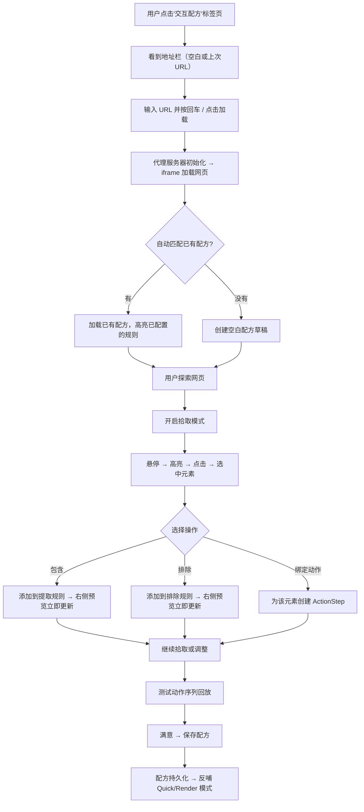

# Web Distillery 交互模式产品设计方案

> **状态**: RFC (Request for Comments) — 修订版 v2
> **创建时间**: 2026-04-21
> **修订时间**: 2026-04-21
> **作者**: 咕咕 (Kilo 版)
> **前置文档**: `INTERACTIVE-MODE-AUDIT.md` (审计报告)

---

## 0. 设计摘要

交互模式的本质是**为复杂网站创建可复用提取配方的可视化工作台**。它是一个**完全独立的标签页**，与"蒸馏工作台"平级并列，拥有自己完整的 URL 输入和网页加载能力。

> **核心原则**：交互配方标签页是自治的——用户可以直接切到该标签页、输入 URL、加载网页、编辑配方。不存在"从蒸馏室打开"或"返回蒸馏室"的概念。

---

## 1. v1 设计审查：发现的问题

### 1.1. 交互设计问题

| 问题                 | 位置                                                                                              | 说明                                                     |
| :------------------- | :------------------------------------------------------------------------------------------------ | :------------------------------------------------------- |
| ❌ "返回蒸馏室"按钮  | [`InteractiveToolbar.vue`](../../../components/interactive/InteractiveToolbar.vue:42) 第 42-45 行 | 交互模式是独立标签页，不是蒸馏室的子视图，不需要返回按钮 |
| ❌ `handleBack` 函数 | [`InteractiveToolbar.vue`](../../../components/interactive/InteractiveToolbar.vue:18) 第 18-19 行 | `store.activeTab = "workbench"` — 不应存在此逻辑         |
| ❌ 设计文档流程      | 原 DESIGN.md §2.3                                                                                 | "退出交互模式 → 返回蒸馏室"的整个流程不合理              |
| ❌ 保存后提示        | 原 DESIGN.md §6.2                                                                                 | "是否返回蒸馏室？"不应存在                               |
| ❌ 进入路径描述      | 原 DESIGN.md §2.2                                                                                 | "从蒸馏工作台切换进入"不是正确的心智模型                 |

### 1.2. 运行时 Bug

**错误现象**：

```
[ERROR] [web-distillery/iframe-bridge] Failed to start proxy server
Error: Proxy server is not running
```

**根因分析**：

| Bug                     | 位置                                                                                           | 说明                                                                                                                 |
| :---------------------- | :--------------------------------------------------------------------------------------------- | :------------------------------------------------------------------------------------------------------------------- |
| ❌ 容器查找方式不可靠   | [`InteractiveToolbar.vue`](../../../components/interactive/InteractiveToolbar.vue:26) 第 26 行 | `document.querySelector('.browser-viewport-inner')` 可能返回 null（DOM 未渲染或被 tab 懒加载隐藏），导致后续流程崩溃 |
| ❌ 代理服务器未预热     | [`iframe-bridge.ts`](../../../core/iframe-bridge.ts:34) `init()` 方法                          | `BrowserViewport.vue` 在 `onMounted` 时立即尝试创建 iframe，但此时 Rust 代理服务器可能尚未启动完成                   |
| ❌ 职责分散导致竞态     | `InteractiveToolbar.vue` + `BrowserViewport.vue`                                               | 两个组件都可以触发 `iframeBridge.create()`，互相竞争，逻辑不一致                                                     |
| ❌ 全局单例生命周期混乱 | [`BrowserViewport.vue`](../../../components/interactive/BrowserViewport.vue:24) 第 24-26 行    | `onUnmounted` 调用 `iframeBridge.dispose()` 会**清理全局消息监听器**，影响其他使用方（如 DistilleryWorkbench）       |

### 1.3. 代码架构问题

| 问题           | 说明                                                                                                                      |
| :------------- | :------------------------------------------------------------------------------------------------------------------------ |
| 职责分散       | 网页加载逻辑分散在 `InteractiveToolbar` 和 `BrowserViewport` 中，前者通过 querySelector 找容器，后者在 onMounted 自动加载 |
| 生命周期管理   | `iframeBridge` 是全局单例，但 `destroy()` / `dispose()` / `forceCleanup()` 在 3 个不同位置被调用，逻辑冲突                |
| 拾取器双重绑定 | `RulesTab.vue` 和 `BrowserViewport.vue` 都监听 `pickerMode` 并调用 `enablePicker()`，会互相覆盖回调                       |

---

## 2. 修订后的核心用户流程

### 2.1. 用户旅程概览



### 2.2. 进入方式

交互配方是一个**标签页**，与"蒸馏工作台""站点配方""身份卡片""API 嗅探"并列。用户只需点击标签即可进入。

| 路径               | 触发方式                                  | 预期行为                                             |
| :----------------- | :---------------------------------------- | :--------------------------------------------------- |
| **直接点击标签页** | 点击"交互配方"Tab                         | 看到工作台，输入 URL 开始工作                        |
| **从结果升级**     | Quick/Render 结果页点击"在交互模式中打开" | 自动切到交互配方 Tab + 填入 URL + 加载网页           |
| **从配方管理进入** | 配方列表点击"编辑"                        | 自动切到交互配方 Tab + 加载配方对应的 URL + 回填规则 |

### 2.3. 保存行为

- 点击"保存配方" → 弹出 `RecipeMetaDrawer` 填写/确认元信息
- 保存成功后 → 提示"配方已保存" → **留在当前标签页继续编辑**
- 没有"是否返回"的弹窗

---

## 3. UI 布局设计（修订版）

### 3.1. 工作台布局

```
┌──────────────────────────────────────────────────────────────────────────────┐
│  [🔗 URL地址栏]                        [🔄 刷新]  [🍪 Cookie]  [📡 API]  [💾 保存]  │
├────────────────────────────────────────────────┬─────────────────────────────┤
│                                                │  ┌─ 工具面板 (Tabs) ─────┐  │
│                                                │  │ [规则] [动作] [预览]   │  │
│                                                │  ├───────────────────────┤  │
│         Iframe 浏览器视口                       │  │                       │  │
│         (flex: 1, min-width: 50%)              │  │  (根据选中 Tab 切换)   │  │
│                                                │  │                       │  │
│         ← 拾取器覆盖层叠加在此                  │  │  Tab 1: 提取/排除规则  │  │
│         ← hover 高亮 + click 选中               │  │  Tab 2: 动作序列编排   │  │
│                                                │  │  Tab 3: 实时预览结果   │  │
│                                                │  │                       │  │
├────────────────────────────────────────────────┤  │                       │  │
│  ┌─ 底部信息栏 ─────────────────────────────┐  │  │                       │  │
│  │ 🔵 拾取模式: 包含  │ <div.article-body>  │  │  │                       │  │
│  │ 已选: 3 包含 / 1 排除 │ 质量预估: 87%    │  │  │                       │  │
│  └──────────────────────────────────────────┘  │  └───────────────────────┘  │
└────────────────────────────────────────────────┴─────────────────────────────┘
```

**关键变化**：顶部工具栏**没有**"← 返回蒸馏室"按钮。URL 地址栏占据完整宽度。

### 3.2. 组件职责分配（修订版）

| 组件                       | 职责                                                                    | 布局位置   |
| :------------------------- | :---------------------------------------------------------------------- | :--------- |
| `InteractiveWorkbench.vue` | 全屏工作台容器，**统一管理 iframe 生命周期**                            | 整体       |
| `InteractiveToolbar.vue`   | 顶部工具栏（URL 输入、刷新、Cookie/API 弹窗入口、保存）                 | 顶部       |
| `BrowserViewport.vue`      | **纯展示**的 Iframe 容器，只暴露 `containerRef`，不主动创建/销毁 iframe | 左侧主区域 |
| `PickerStatusBar.vue`      | 底部状态栏（拾取模式、选中元素信息、统计）                              | 左下       |
| `ToolPanel.vue`            | 右侧 Tab 面板容器                                                       | 右侧       |
| `RulesTab.vue`             | 包含/排除规则列表 + 拾取按钮                                            | 右侧 Tab 1 |
| `ActionsTab.vue`           | 动作序列编排（M2）                                                      | 右侧 Tab 2 |
| `LivePreviewTab.vue`       | 实时蒸馏预览（M2）                                                      | 右侧 Tab 3 |
| `RecipeMetaDrawer.vue`     | 配方元信息编辑抽屉                                                      | 保存时弹出 |

---

## 4. 具体修复方案

### 4.1. 修复 InteractiveToolbar.vue

**删除内容**：

- 移除 `ArrowLeft` 图标导入
- 移除 `handleBack` 函数
- 移除"← 返回蒸馏室"按钮及其分隔线
- 移除 `toolbar-left` 容器

**修改内容**：

- `handleRefresh` / `handleGo` 不再自己找容器和创建 iframe，改为 **emit 事件给 `InteractiveWorkbench`**
- 新增 `emit('load-url', url)` 事件

```typescript
// 修改后的 InteractiveToolbar
const emit = defineEmits(["save", "open-cookie", "open-api", "load-url"]);

const handleGo = () => {
  const url = urlInput.value.trim();
  if (url) emit("load-url", url);
};
```

### 4.2. 修复 BrowserViewport.vue

**核心变化**：BrowserViewport 变为**纯容器**，不再在 `onMounted` 中创建 iframe，也不再在 `onUnmounted` 中 dispose。

- 移除 `onMounted` 中的 `iframeBridge.create()` 调用
- 移除 `onUnmounted` 中的 `iframeBridge.dispose()` 调用
- 移除 `watch(pickerMode)` 监听（拾取器控制统一由 `RulesTab` 处理）
- 移除 `handleElementSelected` 逻辑（由 `RulesTab` 的回调处理）
- **通过 `defineExpose` 暴露 `containerRef`** 给父组件使用

```typescript
// BrowserViewport.vue（简化后）
const containerRef = ref<HTMLElement | null>(null);
defineExpose({ containerRef });
```

### 4.3. 修复 InteractiveWorkbench.vue —— 统一生命周期管理

**核心变化**：`InteractiveWorkbench` 成为 iframe 生命周期的**唯一管理者**。

```typescript
// InteractiveWorkbench.vue
const viewportRef = ref<InstanceType<typeof BrowserViewport> | null>(null);

const loadUrl = async (url: string) => {
  store.setUrl(url);
  const container = viewportRef.value?.containerRef;
  if (!container) {
    customMessage.error("浏览器视口未就绪");
    return;
  }
  try {
    await iframeBridge.init(); // 先确保代理服务器启动
    await iframeBridge.create({ url, container });
    store.initRecipeDraft(); // 创建/匹配配方草稿
  } catch (err) {
    errorHandler.error(err, "网页加载失败");
  }
};

onUnmounted(async () => {
  // 只销毁 iframe，不 dispose 全局单例的消息监听
  await iframeBridge.destroy().catch(() => {});
});
```

### 4.4. 修复 iframeBridge 的 init() 防御性逻辑

当前 `init()` 中如果 `distillery_get_proxy_port` 返回非零端口但代理已停止，会跳过 `distillery_start_proxy`。需要增加健康检查：

```typescript
public async init(): Promise<void> {
  try {
    const existingPort = await invoke<number>('distillery_get_proxy_port');
    if (existingPort > 0) {
      // 已有端口，验证是否可用
      this.proxyPort = existingPort;
    } else {
      // 端口为 0，需要启动
      this.proxyPort = await invoke<number>('distillery_start_proxy');
    }
    logger.info("Proxy server initialized", { port: this.proxyPort });
  } catch (e) {
    this.proxyPort = null;  // 重置，下次重试
    logger.error("Failed to start proxy server", e);
    throw e;
  }

  // 消息监听器注册（保持不变）
  if (!this.messageHandler) { /* ... */ }
}
```

### 4.5. 修复拾取器职责

**统一规则**：拾取器的 `enablePicker` / `disablePicker` 只由 `RulesTab.vue`（以及未来的 `ActionsTab.vue`）通过用户交互触发，`BrowserViewport` 不再监听 `pickerMode` 自动启用拾取器。

---

## 5. 保留的正确设计

以下部分来自 v1 设计，**无需修改**，继续保留：

| 模块                                | 说明                                       |
| :---------------------------------- | :----------------------------------------- |
| 拾取器状态机（§4.1）                | 拾取模式状态机设计正确                     |
| 拾取器视觉区分（§4.2）              | 蓝/红/绿三色区分正确                       |
| 已选元素持久高亮（§4.3）            | 规则回填后保持高亮的逻辑正确               |
| 实时预览机制（§5）                  | 触发时机和防抖策略正确                     |
| 配方生命周期（§6.1）                | 草稿管理逻辑正确                           |
| Store 扩展设计（§7）                | `InteractiveState` 字段设计正确            |
| 组件复用 vs 新建（§8.1）            | 复用决策正确                               |
| selector-picker.js 升级要点（§4.4） | 升级方向正确                               |
| 风险与约束（§11）                   | 分析准确                                   |
| 分步实施计划（§9）                  | 里程碑划分合理（但 M1 任务需按本文档修订） |

---

## 6. M1 修订任务清单

基于调查发现，M1 需要修改以下文件：

| #   | 任务                                                                                                                     | 涉及文件                   | 类型                 |
| :-- | :----------------------------------------------------------------------------------------------------------------------- | :------------------------- | :------------------- |
| 1   | 删除"返回蒸馏室"按钮和 `handleBack`，改为 emit `load-url` 事件                                                           | `InteractiveToolbar.vue`   | 修改                 |
| 2   | 简化为纯容器，移除 `onMounted` 自动加载和 `onUnmounted` dispose，移除 pickerMode watch，`defineExpose({ containerRef })` | `BrowserViewport.vue`      | 修改                 |
| 3   | 统一 iframe 生命周期管理：接收 `load-url` 事件、通过 ref 获取容器、管理 init/create/destroy                              | `InteractiveWorkbench.vue` | 修改                 |
| 4   | `init()` 中增加 `proxyPort` 重置逻辑（catch 中设 null），防止失败后缓存坏状态                                            | `iframe-bridge.ts`         | 修改                 |
| 5   | 确保 `RulesTab.vue` 是拾取器的唯一控制方，不与 BrowserViewport 冲突                                                      | `RulesTab.vue`             | 验证（可能无需改动） |
| 6   | 移除 `DistilleryWorkbench.vue` 中残余的 `isInteractiveMode` watch 和 Level 2 分支                                        | `DistilleryWorkbench.vue`  | 修改                 |

### 不改动的文件

| 文件                   | 原因                                 |
| :--------------------- | :----------------------------------- |
| `WebDistillery.vue`    | 标签页架构正确，交互配方已是独立 Tab |
| `PickerStatusBar.vue`  | 展示逻辑正确                         |
| `ToolPanel.vue`        | 容器结构正确                         |
| `RecipeMetaDrawer.vue` | 保存流程正确（已无"返回蒸馏室"提示） |
| `store.ts`             | 状态字段设计正确                     |

---

## 7. 不在本方案范围内

（与 v1 一致，不做变更）

| 功能                             | 原因                       |
| :------------------------------- | :------------------------- |
| 智能路径推断                     | 算法复杂度高，需要独立设计 |
| 用户行为自动录制转配方           | 需要监听大量事件，复杂度高 |
| DOM 冻结                         | 需求不明确，优先级低       |
| 图片本地化 / 链接修正 / 分页合并 | 属于清洗管道功能           |
| Cookie Lab V2（平台原生 API）    | Rust 端工作量大，独立计划  |

---

**文档结束**
