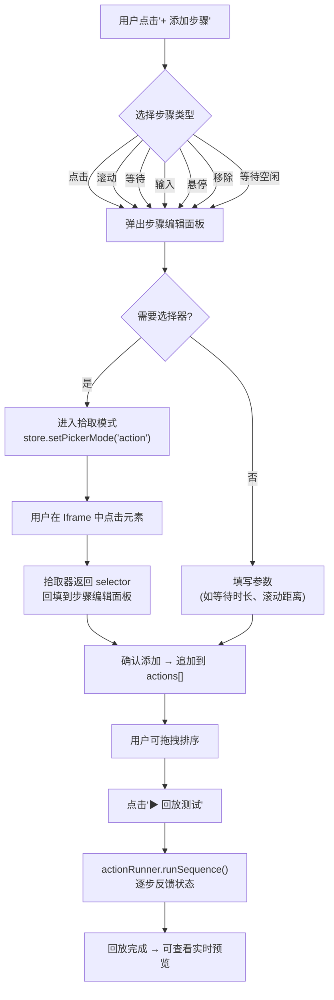
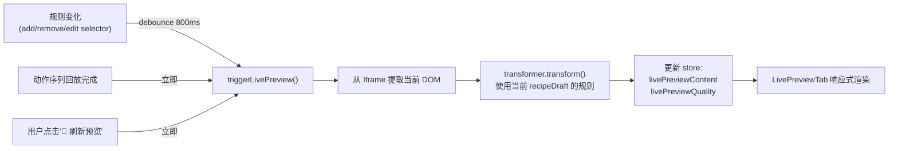

# Web Distillery 交互模式 M2 施工计划

> **状态**: RFC (Request for Comments)
> **创建时间**: 2026-04-21
> **作者**: 咕咕 (Kilo 版)
> **前置文档**: `INTERACTIVE-MODE-DESIGN.md` (设计方案 v2)
> **前置里程碑**: M1 (基础架构修复，已完成)

---

## 0. M2 目标

**让交互模式从"能看网页+能拾取规则"进化为"能编排动作+能实时预览蒸馏效果"的完整工作台。**

M2 交付两个核心 Tab 组件：

1. **ActionsTab** — 动作序列可视化编排
2. **LivePreviewTab** — 实时蒸馏预览面板

---

## 1. 代码现状审计（M2 相关）

### 1.1 已就绪的基础设施 ✅

| 模块           | 文件                                                                | 就绪度       | 说明                                                                                                   |
| :------------- | :------------------------------------------------------------------ | :----------- | :----------------------------------------------------------------------------------------------------- |
| 动作执行引擎   | [`action-runner.ts`](../../../core/action-runner.ts:11)             | ✅ 完整      | 支持 click/scroll/wait/wait-idle/input/hover/remove 7 种步骤类型                                       |
| 动作类型定义   | [`types.ts`](../../../types.ts:137) L137-144                        | ✅ 完整      | `ActionStep` 联合类型定义清晰                                                                          |
| 清洗管道       | [`transformer.ts`](../../../core/transformer.ts:29)                 | ✅ 完整      | `transform(html, options, recipe)` 6 阶段管道                                                          |
| 配方存储       | [`recipe-store.ts`](../../../core/recipe-store.ts:10)               | ✅ 完整      | CRUD + glob 匹配 + 内置配方合并                                                                        |
| Iframe 通信    | [`iframe-bridge.ts`](../../../core/iframe-bridge.ts:152)            | ✅ 完整      | `evalScript()`, `extractDom()`, `waitForDomExtracted()`                                                |
| Store 状态字段 | [`store.ts`](../../../stores/store.ts:32) L32-36                    | ✅ 已预留    | `livePreviewContent`, `livePreviewQuality`, `livePreviewLoading`, `cachedDomSnapshot`, `activeToolTab` |
| 元素拾取器     | [`selector-picker.js`](../../../inject/selector-picker.js:1)        | ✅ M1 已修复 | 使用 `__DISTILLERY_BRIDGE__` 通信                                                                      |
| 保存配方流程   | [`RecipeMetaDrawer.vue`](../../interactive/RecipeMetaDrawer.vue:21) | ✅ 完整      | 含 upsert + 规则摘要                                                                                   |

### 1.2 需要新建的组件 🆕

| 组件                 | 当前状态  | 说明                                                                                                       |
| :------------------- | :-------- | :--------------------------------------------------------------------------------------------------------- |
| `ActionsTab.vue`     | ❌ 空占位 | [`ToolPanel.vue`](../../interactive/ToolPanel.vue:29) L29-31 显示 `el-empty "动作序列编排功能开发中 (M2)"` |
| `LivePreviewTab.vue` | ❌ 空占位 | [`ToolPanel.vue`](../../interactive/ToolPanel.vue:41) L41-43 显示 `el-empty "实时蒸馏预览功能开发中 (M2)"` |

### 1.3 需要增强的现有代码

| 模块                                                     | 需要增强的部分                                                                           | 原因                                                 |
| :------------------------------------------------------- | :--------------------------------------------------------------------------------------- | :--------------------------------------------------- |
| [`store.ts`](../../../stores/store.ts:1)                 | 新增 `addAction`, `removeAction`, `updateAction`, `reorderActions`, `triggerLivePreview` | Store 有状态字段但无 action                          |
| [`iframe-bridge.ts`](../../../core/iframe-bridge.ts:152) | 新增 `extractDomWithSelectors()`                                                         | 实时预览需要按规则提取局部 DOM，而非全量 `outerHTML` |
| [`action-runner.ts`](../../../core/action-runner.ts:12)  | 新增 `executeStepWithFeedback()`                                                         | 编排时需要返回每步执行结果/状态给 UI                 |
| [`ToolPanel.vue`](../../interactive/ToolPanel.vue:1)     | 替换占位为实际组件                                                                       | 当前是 `el-empty`                                    |

---

## 2. ActionsTab 设计

### 2.1 功能概述

允许用户在交互模式中可视化地**创建、编辑、排序、测试**动作序列。动作序列将在 Quick/Render 模式自动提取时**预先回放**（已有 [`actions.ts`](../../../actions.ts:92) L92-95 的调用逻辑），解决"触发后才可见"的动态内容问题。

### 2.2 UI 布局

```
┌─────────────────────────────────────────┐
│  动作序列 (Actions)                      │
├─────────────────────────────────────────┤
│                                         │
│  ┌─ Step 1 ──────────────────────────┐  │
│  │ 🖱 点击  │ .btn-load-more         │  │
│  │ [📝 编辑] [🗑 删除] [⬆⬇ 拖拽]    │  │
│  └───────────────────────────────────┘  │
│                                         │
│  ┌─ Step 2 ──────────────────────────┐  │
│  │ ⏳ 等待  │ 2000ms                 │  │
│  │ [📝 编辑] [🗑 删除] [⬆⬇ 拖拽]    │  │
│  └───────────────────────────────────┘  │
│                                         │
│  ┌─ Step 3 ──────────────────────────┐  │
│  │ 📜 滚动  │ 页面底部               │  │
│  │ [📝 编辑] [🗑 删除] [⬆⬇ 拖拽]    │  │
│  └───────────────────────────────────┘  │
│                                         │
│  [+ 添加步骤 ▾]                         │
│                                         │
│  ────────────────────────────────────   │
│                                         │
│  [▶ 回放测试]  [▶ 单步执行]             │
│                                         │
│  回放状态: Step 2/3 执行中...            │
│  ┌─────────────────────────────────────┐│
│  │ ✅ Step 1: 点击 .btn-load-more     ││
│  │ ⏳ Step 2: 等待 2000ms...          ││
│  │ ⬜ Step 3: 滚动到底部             ││
│  └─────────────────────────────────────┘│
└─────────────────────────────────────────┘
```

### 2.3 交互流程



### 2.4 步骤类型与编辑表单

| 类型        | 图标 | 需要 selector | 其他参数                             | 描述模板                                       |
| :---------- | :--- | :------------ | :----------------------------------- | :--------------------------------------------- |
| `click`     | 🖱   | ✅ 必填       | —                                    | `点击 {selector}`                              |
| `scroll`    | 📜   | ⬜ 可选       | `distance?: number`                  | `滚动到 {selector}` 或 `向下滚动 {distance}px` |
| `wait`      | ⏳   | ⬜ 可选       | `value?: number`, `timeout?: number` | `等待 {value}ms` 或 `等待 {selector} 出现`     |
| `wait-idle` | 💤   | —             | `timeout?: number`                   | `等待页面空闲 {timeout}ms`                     |
| `input`     | ⌨    | ✅ 必填       | `value: string`                      | `输入 "{value}" 到 {selector}`                 |
| `hover`     | 👆   | ✅ 必填       | —                                    | `悬停 {selector}`                              |
| `remove`    | ✂    | ✅ 必填       | —                                    | `移除 {selector}`                              |

### 2.5 拾取模式增强

当前 [`store.ts`](../../../stores/store.ts:136) L136 的 `setPickerMode` 已支持 `'action'` 模式和 `pickerActionIndex`。

**工作流**：

1. 用户在 ActionsTab 点击某个需要 selector 的步骤的"🎯 拾取"按钮
2. `store.setPickerMode('action', stepIndex)`
3. [`PickerStatusBar.vue`](../../interactive/PickerStatusBar.vue:21) 已支持显示"拾取动作目标"
4. 用户在 Iframe 中点击元素
5. `iframeBridge` 收到 `element-selected` 消息，此时 `store.pickerMode === 'action'`
6. 回调将 selector 填入对应步骤

**需要修改**：[`iframe-bridge.ts`](../../../core/iframe-bridge.ts:138) L138 的 `element-selected` 处理需要识别 `action` 模式并路由到 ActionsTab 的回调。

### 2.6 回放测试机制

利用已有的 [`actionRunner.runSequence()`](../../../core/action-runner.ts:98)，增加：

```typescript
// action-runner.ts 增强
interface StepResult {
  index: number;
  status: 'success' | 'error' | 'skipped';
  duration: number;
  error?: string;
}

type StepProgressCallback = (index: number, status: 'running' | 'success' | 'error') => void;

public async runSequenceWithProgress(
  steps: ActionStep[],
  onProgress: StepProgressCallback
): Promise<StepResult[]>
```

---

## 3. LivePreviewTab 设计

### 3.1 功能概述

用户每修改一条提取/排除规则，或执行完动作序列后，右侧**实时**显示蒸馏结果的预览。这样用户可以边调规则边看效果，无需保存配方再去 Quick/Render 模式验证。

### 3.2 UI 布局

```
┌─────────────────────────────────────────┐
│  实时预览 (Live Preview)                 │
├─────────────────────────────────────────┤
│                                         │
│  ┌─ 操作栏 ────────────────────────────┐│
│  │ [🔄 刷新预览] [格式: Markdown ▾]    ││
│  │ 质量: ████████░░ 82%                ││
│  └─────────────────────────────────────┘│
│                                         │
│  ┌─ 预览内容 ──────────────────────────┐│
│  │                                     ││
│  │  # 文章标题                         ││
│  │                                     ││
│  │  正文内容在这里...                   ││
│  │  支持 **加粗** 和 *斜体*            ││
│  │                                     ││
│  │  - 列表项 1                         ││
│  │  - 列表项 2                         ││
│  │                                     ││
│  └─────────────────────────────────────┘│
│                                         │
│  ┌─ 统计信息 ──────────────────────────┐│
│  │ 📊 2,345 字 │ 3 张图 │ 用时 128ms  ││
│  └─────────────────────────────────────┘│
│                                         │
│  [📋 复制内容]  [📄 复制 HTML]          │
└─────────────────────────────────────────┘
```

### 3.3 触发机制

实时预览的触发需要**防抖**，避免频繁重算：



### 3.4 DOM 提取策略

**关键问题**：实时预览需要从 Iframe 获取 **当前状态** 的 DOM（可能已被动作序列修改），然后用 `transformer` 按当前 `recipeDraft` 的规则清洗。

**两种策略**：

| 策略                       | 实现                                                          | 优点                   | 缺点                                               |
| :------------------------- | :------------------------------------------------------------ | :--------------------- | :------------------------------------------------- |
| **A: 全量提取 + 前端清洗** | `extractDom()` → 拿到 `outerHTML` → `transformer.transform()` | 简单可靠，复用现有管道 | 每次传输完整 DOM，可能较慢                         |
| **B: Iframe 内局部提取**   | 向 Iframe 注入脚本，按 selector 提取 + 排除后传回             | 传输量小               | 需要在 Iframe 内重新实现一部分清洗逻辑，维护成本高 |

**决策**：采用**策略 A**。理由：

1. `transformer` 管道已经过充分测试，复用它可靠性最高
2. DOM 大小通常在 100KB-2MB 量级，`postMessage` 完全能承受
3. Store 已预留 `cachedDomSnapshot` 字段，可缓存最近一次的 DOM 快照避免重复提取

### 3.5 预览渲染方式

- 默认输出格式为 Markdown
- 使用项目已有的 Markdown 渲染能力（`markdown-it`）进行渲染
- 提供"源码/渲染"切换，源码模式下显示原始 Markdown 文本

---

## 4. Store 增强

[`store.ts`](../../../stores/store.ts:1) 需要新增以下 actions：

```typescript
// =========== 动作序列管理 ===========

/** 添加一个动作步骤 */
addAction(step: ActionStep) {
  if (!this.recipeDraft) return;
  const draft = { ...this.recipeDraft };
  draft.actions = [...(draft.actions || []), step];
  this.recipeDraft = draft;
  this.isDraftDirty = true;
}

/** 删除一个动作步骤 */
removeAction(index: number) {
  if (!this.recipeDraft?.actions) return;
  const draft = { ...this.recipeDraft };
  draft.actions = draft.actions!.filter((_, i) => i !== index);
  this.recipeDraft = draft;
  this.isDraftDirty = true;
}

/** 更新一个动作步骤 */
updateAction(index: number, step: ActionStep) {
  if (!this.recipeDraft?.actions) return;
  const draft = { ...this.recipeDraft };
  draft.actions = [...draft.actions!];
  draft.actions[index] = step;
  this.recipeDraft = draft;
  this.isDraftDirty = true;
}

/** 重排动作序列 */
reorderActions(fromIndex: number, toIndex: number) {
  if (!this.recipeDraft?.actions) return;
  const draft = { ...this.recipeDraft };
  const actions = [...draft.actions!];
  const [moved] = actions.splice(fromIndex, 1);
  actions.splice(toIndex, 0, moved);
  draft.actions = actions;
  this.recipeDraft = draft;
  this.isDraftDirty = true;
}

// =========== 实时预览 ===========

/** 设置预览内容 */
setLivePreview(content: string, quality: number) {
  this.livePreviewContent = content;
  this.livePreviewQuality = quality;
  this.livePreviewLoading = false;
}

/** 设置预览加载状态 */
setLivePreviewLoading(loading: boolean) {
  this.livePreviewLoading = loading;
}

/** 缓存 DOM 快照 */
setCachedDomSnapshot(html: string) {
  this.cachedDomSnapshot = html;
}
```

---

## 5. IframeBridge 增强

[`iframe-bridge.ts`](../../../core/iframe-bridge.ts:1) 需要增强 `extractDom` 以支持实时预览场景：

```typescript
/**
 * 提取当前 Iframe DOM 快照（用于实时预览）
 * 区别于原有 extractDom：不 wait for selector，直接拿当前状态
 */
public async extractCurrentDom(): Promise<{ html: string; url: string; title: string }> {
  const script = `
    (function() {
      if (window.__DISTILLERY_BRIDGE__) {
        window.__DISTILLERY_BRIDGE__.send({
          type: 'dom-extracted',
          html: document.documentElement.outerHTML,
          url: window.location.href,
          title: document.title
        });
      }
    })();
  `;

  const promise = this.waitForDomExtracted(5000);
  await this.evalScript(script);
  return promise;
}
```

---

## 6. ActionRunner 增强

[`action-runner.ts`](../../../core/action-runner.ts:1) 需要增加带进度回调的执行方法：

```typescript
export interface StepResult {
  index: number;
  status: 'success' | 'error' | 'skipped';
  duration: number;
  error?: string;
}

export type StepProgressCallback = (
  index: number,
  status: 'running' | 'success' | 'error',
  error?: string
) => void;

/** 执行整个动作序列（带逐步进度反馈） */
public async runSequenceWithProgress(
  steps: ActionStep[],
  onProgress: StepProgressCallback
): Promise<StepResult[]> {
  const results: StepResult[] = [];

  for (let i = 0; i < steps.length; i++) {
    onProgress(i, 'running');
    const startTime = performance.now();

    try {
      await this.executeStep(steps[i]);
      const duration = performance.now() - startTime;
      results.push({ index: i, status: 'success', duration });
      onProgress(i, 'success');
    } catch (e) {
      const duration = performance.now() - startTime;
      const errorMsg = e instanceof Error ? e.message : String(e);
      results.push({ index: i, status: 'error', duration, error: errorMsg });
      onProgress(i, 'error', errorMsg);
      // 继续执行后续步骤
    }
  }

  return results;
}
```

---

## 7. 实施任务清单

### 7.1 Phase A：Store 与引擎增强（基础层）

| #   | 任务                                                                                        | 涉及文件                | 类型 | 依赖 |
| :-- | :------------------------------------------------------------------------------------------ | :---------------------- | :--- | :--- |
| A1  | 新增动作序列管理 actions：`addAction`, `removeAction`, `updateAction`, `reorderActions`     | `stores/store.ts`       | 修改 | —    |
| A2  | 新增实时预览 actions：`setLivePreview`, `setLivePreviewLoading`, `setCachedDomSnapshot`     | `stores/store.ts`       | 修改 | —    |
| A3  | `ActionRunner` 增加 `runSequenceWithProgress()` 和 `StepResult`/`StepProgressCallback` 类型 | `core/action-runner.ts` | 修改 | —    |
| A4  | `IframeBridge` 增加 `extractCurrentDom()` 方法                                              | `core/iframe-bridge.ts` | 修改 | —    |

### 7.2 Phase B：ActionsTab 组件（动作序列编排）

| #   | 任务                                                                                | 涉及文件                                | 类型 | 依赖   |
| :-- | :---------------------------------------------------------------------------------- | :-------------------------------------- | :--- | :----- |
| B1  | 创建 `ActionsTab.vue` — 动作列表展示（卡片式，含图标/类型/描述/操作按钮）           | `components/interactive/ActionsTab.vue` | 新建 | A1     |
| B2  | 实现"添加步骤"下拉菜单 — 选择步骤类型后弹出编辑面板                                 | `ActionsTab.vue` 内                     | 新建 | B1     |
| B3  | 实现步骤编辑内联面板 — 根据步骤类型动态显示不同字段（selector、value、distance 等） | `ActionsTab.vue` 内                     | 新建 | B2     |
| B4  | 实现"🎯 拾取"按钮 — 点击后进入 `pickerMode='action'`，选中后回填 selector           | `ActionsTab.vue` 内                     | 新建 | B3     |
| B5  | 实现拖拽排序（使用 HTML Drag and Drop API 或 `@vueuse/core` 的 `useSortable`）      | `ActionsTab.vue` 内                     | 新建 | B1     |
| B6  | 实现"▶ 回放测试" — 调用 `actionRunner.runSequenceWithProgress()`，逐步显示状态      | `ActionsTab.vue` 内                     | 新建 | A3, B1 |
| B7  | 在 `ToolPanel.vue` 中替换 actions tab 的占位为 `<ActionsTab />`                     | `components/interactive/ToolPanel.vue`  | 修改 | B1     |

### 7.3 Phase C：LivePreviewTab 组件（实时蒸馏预览）

| #   | 任务                                                                                                              | 涉及文件                                    | 类型 | 依赖   |
| :-- | :---------------------------------------------------------------------------------------------------------------- | :------------------------------------------ | :--- | :----- |
| C1  | 创建 `LivePreviewTab.vue` — 基本布局（操作栏 + 预览区 + 统计信息）                                                | `components/interactive/LivePreviewTab.vue` | 新建 | A2     |
| C2  | 实现核心预览逻辑 — `triggerLivePreview()` composable：从 Iframe 提取 DOM → `transformer.transform()` → 更新 store | `composables/useLivePreview.ts` 或内联      | 新建 | A4, C1 |
| C3  | 实现防抖监听 — watch `recipeDraft.extractSelectors` / `excludeSelectors` 变化，debounce 800ms 后触发预览          | `LivePreviewTab.vue` 内                     | 新建 | C2     |
| C4  | 实现 Markdown 渲染展示 — 使用 `markdown-it` 渲染预览内容，支持源码/渲染切换                                       | `LivePreviewTab.vue` 内                     | 新建 | C1     |
| C5  | 实现质量指示器 — 显示 `livePreviewQuality` 进度条，颜色分级（红/黄/绿）                                           | `LivePreviewTab.vue` 内                     | 新建 | C1     |
| C6  | 实现"📋 复制"按钮 — 复制 Markdown/HTML 内容到剪贴板                                                               | `LivePreviewTab.vue` 内                     | 新建 | C1     |
| C7  | 在 `ToolPanel.vue` 中替换 preview tab 的占位为 `<LivePreviewTab />`                                               | `components/interactive/ToolPanel.vue`      | 修改 | C1     |

### 7.4 Phase D：串联与联调

| #   | 任务                                                                                                          | 涉及文件                                            | 类型 | 依赖   |
| :-- | :------------------------------------------------------------------------------------------------------------ | :-------------------------------------------------- | :--- | :----- |
| D1  | 动作回放完成后自动触发实时预览                                                                                | `ActionsTab.vue` + `LivePreviewTab.vue`             | 修改 | B6, C2 |
| D2  | 动作编排中的 `pickerMode='action'` 与 `element-selected` 消息路由联调                                         | `iframe-bridge.ts` handleMessage + `ActionsTab.vue` | 修改 | B4     |
| D3  | `RecipeMetaDrawer.vue` 保存时确保 `actions` 数组包含在 recipeDraft 中（已支持，验证即可）                     | `RecipeMetaDrawer.vue`                              | 验证 | —      |
| D4  | 端到端测试：从加载网页 → 拾取规则 → 编排动作 → 回放测试 → 查看预览 → 保存配方 → Quick/Render 模式验证配方生效 | 全链路                                              | 测试 | ALL    |

---

## 8. 文件变更总览

### 8.1 新建文件

| 路径                                                                 | 说明             |
| :------------------------------------------------------------------- | :--------------- |
| `src/tools/web-distillery/components/interactive/ActionsTab.vue`     | 动作序列编排 Tab |
| `src/tools/web-distillery/components/interactive/LivePreviewTab.vue` | 实时蒸馏预览 Tab |

### 8.2 修改文件

| 路径                                                            | 修改内容                                                 |
| :-------------------------------------------------------------- | :------------------------------------------------------- |
| `src/tools/web-distillery/stores/store.ts`                      | 新增 6 个 actions（A1+A2）                               |
| `src/tools/web-distillery/core/action-runner.ts`                | 新增 `runSequenceWithProgress()` + 类型导出（A3）        |
| `src/tools/web-distillery/core/iframe-bridge.ts`                | 新增 `extractCurrentDom()`（A4）                         |
| `src/tools/web-distillery/components/interactive/ToolPanel.vue` | 导入并使用 ActionsTab / LivePreviewTab 替换占位（B7+C7） |

### 8.3 不改动的文件

| 文件                       | 原因                        |
| :------------------------- | :-------------------------- |
| `InteractiveWorkbench.vue` | M1 已修复，M2 无需变动      |
| `InteractiveToolbar.vue`   | M1 已修复，M2 无需变动      |
| `BrowserViewport.vue`      | 纯容器 + 高亮同步逻辑正确   |
| `PickerStatusBar.vue`      | 已支持 `action` 模式显示    |
| `RecipeMetaDrawer.vue`     | 保存逻辑已包含 actions 摘要 |
| `selector-picker.js`       | M1 已修复通信               |
| `bridge.js`                | 无需变动                    |
| `transformer.ts`           | 管道完整，无需变动          |
| `recipe-store.ts`          | CRUD 完整，无需变动         |
| `types.ts`                 | `ActionStep` 定义已完整     |

---

## 9. 风险与约束

| 风险              | 影响                                              | 缓解措施                                                                   |
| :---------------- | :------------------------------------------------ | :------------------------------------------------------------------------- |
| 实时预览性能      | 大型页面 DOM (>2MB) 通过 postMessage 传输可能卡顿 | 缓存 `cachedDomSnapshot`，规则变化时复用缓存而非重新提取                   |
| 动作回放幂等性    | 某些动作（如 `remove`）不可逆，多次回放结果不同   | 回放前可提示"建议先刷新页面以重置状态"                                     |
| 拖拽排序库选择    | 引入新依赖的兼容性                                | 优先使用 `@vueuse/core` 的 `useSortable`（项目已有 @vueuse），不引入额外库 |
| Markdown 渲染安全 | 预览内容可能包含恶意脚本                          | 使用 `DOMPurify`（项目已有）净化渲染后的 HTML                              |
| 预览防抖时机      | 800ms 防抖可能让用户觉得"没反应"                  | 防抖开始时立即设置 `livePreviewLoading = true`，给用户视觉反馈             |

---

## 10. 不在 M2 范围内

| 功能                                                            | 原因                         | 预计里程碑 |
| :-------------------------------------------------------------- | :--------------------------- | :--------- |
| 用户行为自动录制转配方                                          | 需要全量事件监听，复杂度极高 | M3+        |
| 智能路径推断（点击同类元素自动生成通用选择器）                  | 算法复杂度高，需要独立设计   | M3+        |
| 图片本地化                                                      | 清洗管道功能，与交互模式解耦 | P5         |
| 分页合并                                                        | 清洗管道功能，与交互模式解耦 | P5         |
| Cookie Lab V2                                                   | Rust 端 API 工作量大         | 独立计划   |
| 配方管理列表（站点配方 Tab 的 UI）                              | 独立功能，非交互模式核心     | M3         |
| "从结果升级"入口（Quick/Render 结果页的"在交互模式中打开"按钮） | 交互模式核心完善后再做入口   | M3         |

---

**文档结束**
