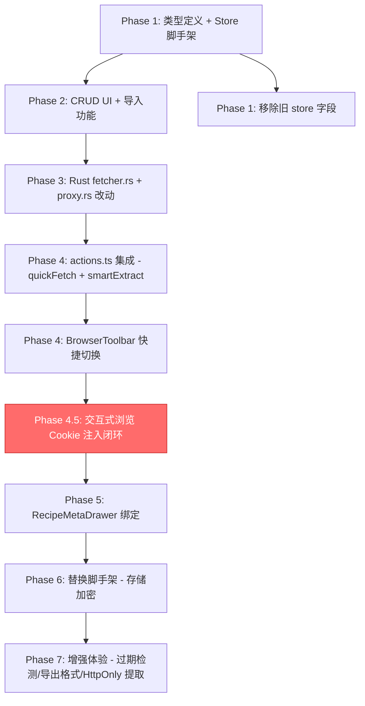

# 身份卡片 (Identity Card) 功能规划

> **状态**: Implementing (P0-P2 部分完成，⚠️ P0.5 缺失——交互式浏览的 Cookie 注入/保存闭环未实现)
> **创建日期**: 2025-05-12
> **最后更新**: 2025-05-12
> **所属模块**: `src/tools/web-distillery/components/CookieLab.vue`

---

## 0. ⚠️ 当前阻塞问题（2025-05-12 调查）

### 0.1 问题描述

计划文档标记 P0-P2 为"完成"，但实际上存在一个**关键的断裂环节**——整个 Cookie 生命周期中最基础的一步没有实现：

**交互式浏览模式下，cookies 既不会被自动注入到代理，也不会在用户登录后被保存。**

错误现象：`GET http://127.0.0.1:61077/api/user/self 401 (Unauthorized)` — 代理转发请求时不带 Cookie。

### 0.2 断裂链路

```
用户在交互式浏览中打开页面
    ↓
iframe 通过代理加载 → 代理的 fallback 转发 XHR 请求
    ↓
但 DISTILLERY_PROXY_STATE.active_cookies 为 null（没人设置过）
    ↓
代理转发请求时不带 Cookie header → 目标服务器返回 401
```

### 0.3 具体缺失点

| # | 缺失环节 | 现状 | 影响 |
|---|---------|------|------|
| 1 | **交互式浏览加载页面时注入 cookies** | `DistilleryWorkbench.handleFetch()` 中 smart 模式调用 `smartExtract`（会注入），但交互式浏览模式加载页面时**没有人调用 `distillery_set_proxy_cookies`** | 即使 Profile 已激活，交互式浏览也不会带身份 |
| 2 | **身份切换后更新代理状态** | `BrowserToolbar.handleIdentitySwitch()` 只调用了 `cookieProfileStore.toggleActive()`，**没有调用 `distillery_set_proxy_cookies`**，也没有刷新页面 | 切换身份后当前页面不会感知变化 |
| 3 | **用户在 iframe 中登录后保存 cookies** | 完全没有实现。当前只有手动去 CookieLab 点"从浏览器抓取"才能保存，且只能读非 HttpOnly cookies | 用户登录后 cookies 只存在于 iframe 的浏览器 cookie jar 中，代理端口变化或 iframe 重建后就丢失 |
| 4 | **代理层 Set-Cookie 响应头的捕获与回传** | `proxy.rs` 的 `unsafe_headers` 中没有 `set-cookie`，所以会透传给 iframe，但**没有机制将其回传给前端保存** | HttpOnly cookies 永远无法被前端感知和持久化 |

### 0.4 当前已实现 vs 缺失对比

```
✅ 已实现（能用）：
  - CookieProfile CRUD（创建/编辑/删除/导入/导出）
  - 代理层 active_cookies 注入逻辑（proxy.rs fallback + proxy-resource）
  - smartExtract 蒸馏时自动注入 cookies
  - quickFetch 蒸馏时自动注入 cookies
  - BrowserToolbar 身份下拉 UI（只是展示）

❌ 缺失（不能用）：
  - 交互式浏览加载页面时注入 cookies
  - 身份切换后更新代理 + 刷新页面
  - 用户登录后保存 cookies 到 Profile
  - Set-Cookie 响应头捕获回传
```

### 0.5 修复优先级

**Phase 4.5** 必须在 Phase 5（加密）之前完成，否则整个身份卡片功能在交互式浏览场景下完全不可用。

---

## 1. 现状分析

### 1.1 当前实现

当前 `CookieLab.vue` 仅实现了最基础的 cookie 读写：

| 已有功能          | 实现方式                                             | 局限性                               |
| ----------------- | ---------------------------------------------------- | ------------------------------------ |
| 读取当前页 Cookie | `iframeBridge.getCookies()` → 读 `document.cookie`   | 只能读非 HttpOnly cookie，原始字符串 |
| 注入单条 Cookie   | `iframeBridge.setCookie(str)` → 写 `document.cookie` | 无校验、无域名绑定、无持久化         |
| 列表展示          | 按 `;` 分割显示 key=value                            | 无解析、无编辑、无删除               |

### 1.2 已预留但未实现的接口

| 位置                                           | 预留设计                  | 状态                 |
| ---------------------------------------------- | ------------------------- | -------------------- |
| `types.ts` → `SiteRecipe.cookieProfile`        | 配方可绑定 Cookie Profile | ❌ 无联动            |
| `types.ts` → `QuickFetchOptions.cookieProfile` | 抓取时携带 cookie         | ❌ actions.ts 未使用 |
| `stores/store.ts` → `cookieProfiles: string[]` | 多套身份管理              | ❌ 空数组，无 CRUD   |
| `types.ts` → 错误码 `COOKIE_EXPIRED`           | Cookie 过期检测           | ❌ 无检测逻辑        |

### 1.3 代码调查详细发现 (2025-05-12)

#### Rust 后端现状

| 文件               | 发现                                                        | 影响                                |
| ------------------ | ----------------------------------------------------------- | ----------------------------------- |
| `fetcher.rs:9`     | `cookie_profile: Option<String>` 已定义但**完全未使用**     | quickFetch 无法携带 cookie          |
| `fetcher.rs:36-45` | 请求构建只处理 `headers`，忽略 `cookie_profile`             | 需要补充 Cookie header 注入逻辑     |
| `proxy.rs:121-229` | `handle_proxy_html` 无 cookie 转发机制                      | iframe 代理请求无法携带身份         |
| `proxy.rs:18-19`   | `DISTILLERY_PROXY_STATE` 全局状态只有 port/running/shutdown | 可扩展为携带 active cookies         |
| `proxy.rs:144-159` | 过滤了 `content-encoding` 等头，但**未过滤 `set-cookie`**   | 响应中的 Set-Cookie 会透传给 iframe |

#### 前端现状

| 文件                       | 发现                                                    | 影响                              |
| -------------------------- | ------------------------------------------------------- | --------------------------------- |
| `actions.ts:27-35`         | `quickFetch` 传递 `cookieProfile` 给 Rust，但 Rust 忽略 | 管道已通，只需 Rust 端补逻辑      |
| `iframe-bridge.ts:303-316` | `getCookies()` 只能读 `document.cookie`（非 HttpOnly）  | HttpOnly cookie 需代理层提取      |
| `iframe-bridge.ts:333-336` | `setCookie()` 通过 `document.cookie` 写入               | 同上，HttpOnly 无法通过此方式注入 |
| `stores/store.ts:38`       | `cookieProfiles: string[]` 空数组                       | 需要替换为完整的 Profile 管理     |
| `BrowserToolbar.vue`       | 工具栏有模式选择器，可在旁边加身份选择器                | 空间足够                          |
| `RecipeMetaDrawer.vue`     | 配方保存抽屉，无 cookieProfile 绑定 UI                  | 需添加下拉选择器                  |

#### 依赖现状 (Cargo.toml)

- ✅ 已有：`reqwest`（HTTP 客户端）、`axum`（代理服务器）、`serde_json`、`nanoid`
- ❌ 缺失：无加密库（`aes-gcm`、`ring`）、无系统密钥管理库（`keyring`）
- ⚠️ 已有 `sha2` 和 `blake3`（哈希），但不适合对称加密

---

## 2. 产品定位

"身份卡片"的核心价值是：**让用户能保存和管理多个网站的登录态（Cookie），并在蒸馏时自动注入，实现"带身份抓取"。**

典型场景：

- 用户登录了某付费内容站，想抓取登录后才能看到的文章
- 用户有多个账号身份，需要切换不同 cookie 配置
- 配方绑定特定身份，自动化抓取时无需每次手动注入

---

## 3. 功能设计

### 3.1 核心数据模型

```typescript
/** 单条 Cookie */
interface CookieEntry {
  name: string;
  value: string;
  domain: string;
  path: string;
  expires?: string; // ISO 日期字符串
  httpOnly?: boolean;
  secure?: boolean;
  sameSite?: "Strict" | "Lax" | "None";
}

/** Cookie 身份卡片 (Profile) */
interface CookieProfile {
  id: string; // nanoid
  name: string; // 用户自定义名称，如 "知乎-主号"
  domain: string; // 主域名，如 "zhihu.com"
  domainAliases?: string[]; // 可选：关联子域名 (如 "www.zhihu.com", "zhuanlan.zhihu.com")
  cookies: CookieEntry[];
  isActive: boolean; // 是否为该域名当前激活的身份
  createdAt: string;
  updatedAt: string;
  lastUsedAt?: string;
  notes?: string; // 备注
}
```

### 3.2 功能模块

#### P0 — 基础 CRUD + 持久化

- [x] 定义 `CookieEntry` / `CookieProfile` 类型（在 `types.ts` 中）
- [x] 创建 `core/cookie-profile-store.ts`，使用 `createConfigManager` 持久化到 `AppData/web-distillery/cookie-profiles.json`
- [x] Profile 列表视图（卡片式，按域名分组，显示名称、cookie 数量、最后使用时间）
- [x] 创建/编辑/删除 Profile
- [x] 单条 Cookie 的增删改查（表格形式，字段：name, value, domain, path, expires）
- [x] 域名互斥激活机制（同域名下只能有一个 Profile 激活）
- [x] 移除 `stores/store.ts` 中旧的 `cookieProfiles: string[]` 字段

#### P0.5 — 交互式浏览的 Cookie 注入与保存闭环（⚠️ 缺失，阻塞实际使用）

> **这是当前最关键的缺失环节。** 没有这一步，即使 P0-P2 的 CRUD/导入/Rust 注入全部实现了，用户在交互式浏览模式下也无法使用身份卡片功能。

- [ ] **交互式浏览加载页面时注入 cookies**：当用户在交互式浏览模式中加载页面时，应在 `iframeBridge.create()` 之前调用 `distillery_set_proxy_cookies`，将当前 URL 匹配的激活 Profile 的 cookies 注入代理
- [ ] **身份切换后立即更新代理 + 刷新页面**：`BrowserToolbar.handleIdentitySwitch()` 中切换身份后，应立即调用 `distillery_set_proxy_cookies` 更新代理状态，并触发页面重新加载
- [ ] **用户登录后保存 cookies（半自动）**：在 BrowserToolbar 或 BrowserViewport 中提供"保存当前 Cookie"按钮，一键将 iframe 中的 `document.cookie` 保存/更新到对应的 CookieProfile
- [ ] **代理层 Set-Cookie 响应头捕获与回传（自动）**：Rust `proxy.rs` 的 fallback/proxy 路由在转发响应时，提取 `Set-Cookie` 头并通过注入脚本回传给前端，前端自动更新对应 Profile 的 cookies（覆盖 HttpOnly 场景）

#### P1 — 导入导出

- [x] 从当前浏览器页面"一键抓取"所有 cookie 到新 Profile
- [x] 从 JSON 文件导入（兼容 EditThisCookie 导出格式）
- [x] 从 Netscape/cURL 格式导入（`# Netscape HTTP Cookie File` 格式）
- [x] 导出为 JSON / cURL header 格式
- [ ] 导出为明文 JSON 备份（用于密钥丢失恢复场景）

#### P2 — 配方联动 + 自动注入

- [ ] 配方编辑器 (`RecipeMetaDrawer.vue`) 中添加"绑定身份卡片"下拉选择器
- [x] `BrowserToolbar.vue` 地址栏旁添加身份快捷切换下拉
- [x] `smartExtract` 流程中：设置代理 cookie → iframe 加载时自动携带
- [x] `quickFetch` 流程中：将 cookie 作为 `cookies` 参数传递给 Rust `distillery_quick_fetch`
- [x] Rust `fetcher.rs` 使用 `cookies` 参数注入 Cookie header
- [x] Rust `proxy.rs` 扩展全局状态，支持代理请求携带 cookie

#### P1.5 — 存储加密（替换明文脚手架）

- [ ] Rust 端实现平台加密命令（`cookie_encrypt_values` / `cookie_decrypt_values`）
- [ ] Windows: DPAPI (`CryptProtectData` / `CryptUnprotectData`)
- [ ] macOS: Security Framework (`SecItemAdd` / `SecItemCopyMatching`)
- [ ] Linux: libsecret（AIO 是 GUI 应用，必然有桌面环境）
- [ ] 前端 Store 的 `load()` / `save()` 改为通过 Rust 命令加解密 cookie value
- [ ] 直接替换明文存储实现（无需迁移逻辑，开发阶段不发版）

#### P3 — 增强体验

- [ ] Cookie 过期检测 + 提醒（解析 expires 字段，标红已过期条目）
- [ ] 域名自动匹配建议（输入 URL 时自动推荐匹配的 Profile）
- [ ] HttpOnly cookie 支持（Rust 代理层在响应中提取 `Set-Cookie` 头并回传）
- [ ] Profile 使用统计（记录每次使用时间，按最近使用排序）
- [ ] 可选文件级加密升级（AES-256-GCM，整个 JSON 文件加密，防止元数据泄露）

### 3.3 UI 布局草案

```
┌─────────────────────────────────────────────────────────┐
│ 身份卡片                              [+ 新建] [导入]    │
├─────────────────────────────────────────────────────────┤
│                                                         │
│  zhihu.com                                    [+ 新建]  │
│  ┌────────────────────┐  ┌────────────────────┐        │
│  │ ◉ 知乎-主号        │  │ ○ 知乎-小号        │        │
│  │   12 条 cookie     │  │   8 条 cookie      │        │
│  │   ✅ 激活中        │  │   点击切换          │        │
│  └────────────────────┘  └────────────────────┘        │
│                                                         │
│  github.com                                   [+ 新建]  │
│  ┌────────────────────┐                                 │
│  │ ◉ GitHub 个人      │  (仅一个，默认激活)              │
│  │   8 条 cookie      │                                 │
│  └────────────────────┘                                 │
│                                                         │
│  weibo.com                                    [+ 新建]  │
│  ┌────────────────────┐  ┌────────────────────┐        │
│  │ ○ 微博-工作号      │  │ ○ 微博-生活号      │        │
│  │   ⚠️ 已过期        │  │   5 条 cookie      │        │
│  └────────────────────┘  └────────────────────┘        │
│  (该域名当前无激活身份)                                  │
├─────────────────────────────────────────────────────────┤
│ [点击卡片展开详情]                                       │
│                                                         │
│  名称: GitHub 个人     域名: github.com                  │
│  备注: 个人开发账号                                      │
│  ┌─────────────────────────────────────────────┐        │
│  │ Name          │ Value    │ Expires │ 操作   │        │
│  │ _gh_sess      │ abc...   │ 7天后   │ ✏️ 🗑️ │        │
│  │ logged_in     │ yes      │ 30天后  │ ✏️ 🗑️ │        │
│  │ dotcom_user   │ miao...  │ 永久    │ ✏️ 🗑️ │        │
│  └─────────────────────────────────────────────┘        │
│                                                         │
│  [从当前页面抓取] [手动添加] [导出] [删除此卡片]         │
└─────────────────────────────────────────────────────────┘
```

---

## 4. 身份切换与互斥机制

### 4.1 核心概念：域名互斥组

同一个域名下可以存在多个 Profile（如"知乎-主号"和"知乎-小号"），但**同一时间只能有一个处于激活状态**。这形成了一个天然的"互斥组"（Radio Group）。

### 4.2 交互设计

#### 切换交互

- **点击未激活卡片** → 该卡片变为激活，同域名下其他卡片自动取消激活（Radio 行为）
- **点击已激活卡片** → 取消激活（该域名变为"无身份"状态）
- **快捷切换**：在 `BrowserToolbar.vue` 的工具栏中，显示当前页面域名匹配到的 Profile 下拉列表，可一键切换

#### 工具栏快捷入口

```
┌──────────────────────────────────────────────────────────┐
│ 🔗 https://www.zhihu.com/question/...  │ 🍪 知乎-主号 ▾ │
│                                        ├────────────────┤
│                                        │ ◉ 知乎-主号   │
│                                        │ ○ 知乎-小号   │
│                                        │ ─────────────  │
│                                        │ ○ 无身份      │
│                                        └────────────────┘
└──────────────────────────────────────────────────────────┘
```

### 4.3 激活逻辑

```typescript
/** 切换激活状态（互斥） */
function toggleProfile(profileId: string) {
  const target = profiles.find((p) => p.id === profileId);
  if (!target) return;

  if (target.isActive) {
    // 取消激活
    target.isActive = false;
  } else {
    // 激活目标，同时取消同域名下其他 profile
    profiles.filter((p) => p.domain === target.domain).forEach((p) => (p.isActive = false));
    target.isActive = true;
  }
}

/** 根据 URL 获取当前应使用的 Profile */
function getActiveProfileForUrl(url: string): CookieProfile | null {
  const hostname = new URL(url).hostname;
  // 匹配主域名或子域名别名
  return (
    profiles.find(
      (p) =>
        p.isActive &&
        (hostname === p.domain || hostname.endsWith("." + p.domain) || p.domainAliases?.includes(hostname)),
    ) || null
  );
}
```

### 4.4 与蒸馏流程的集成

抓取时自动使用激活的身份：

```
用户输入 URL (如 zhihu.com/article/xxx)
    │
    ▼
getActiveProfileForUrl(url) → 找到 "知乎-主号" (isActive: true)
    │
    ▼
拼接 cookie 字符串: "key1=val1; key2=val2; ..."
    │
    ├─→ quickFetch: 作为 cookies 参数传给 Rust fetcher
    └─→ smartExtract: 设置代理全局状态 + iframe 加载后注入非 HttpOnly cookie
```

用户无需每次手动选择——只要提前激活了对应域名的身份卡片，蒸馏时就会自动携带。

---

## 5. 技术方案

### 5.1 持久化方案（分级策略）

#### 方案评估

| 方案                              | 复杂度 | 新增依赖     | 安全性                                | 适用阶段  |
| --------------------------------- | ------ | ------------ | ------------------------------------- | --------- |
| A: 明文 JSON (configManager)      | 低     | 0            | **低**（同用户下任何程序可读）        | P0 临时   |
| B: DPAPI/Keychain 加密 cookie 值  | 中     | 1-2 个 crate | 中高（与 Chrome 同级）                | **P1**    |
| C: Rust 端 AES-256-GCM + keyring  | 高     | 3-4 个 crate | 高                                    | P3 可选   |
| D: 混合方案（JSON + base64 混淆） | 低     | 0            | **低**（混淆 ≠ 加密，安全性等同明文） | ❌ 不采用 |

#### 决策：明文作为开发脚手架，发版前必须替换为平台级加密

**安全性事实（不要自欺欺人）**：

1. **AppData 在 Windows 下几乎不设防**：同一用户账户下运行的任何程序都能自由读取 `%APPDATA%` 中的所有文件，包括恶意软件、浏览器扩展的 Native Host、甚至一个简单的 PowerShell 脚本。所谓"OS 用户权限保护"只能防其他用户账户，对同用户下的威胁毫无作用。
2. **我们不是浏览器**：Chrome/Firefox 在各平台上都对 cookie 值做了加密（Windows 用 DPAPI，macOS 用 Keychain，Linux 用 libsecret/kwallet）。我们的应用是自己把 cookie 存到磁盘文件，不能拿浏览器的安全机制来为自己的明文存储辩护——浏览器加密了，我们没有。
3. **"其他数据也是明文"不是理由**：项目中 LLM API Key 也是明文存储，这说明那边也有问题，不能用一个已有的安全缺陷来合理化新的安全缺陷。
4. **Cookie 比 API Key 更敏感**：API Key 泄露后可以重新生成；Cookie 泄露意味着攻击者可以直接冒充用户身份登录网站，且用户可能完全不知情。

**开发阶段使用明文 JSON 作为脚手架**：

1. 功能验证优先——先确保 CRUD、注入、配方联动等核心流程跑通
2. 明文便于开发调试（直接查看/编辑 JSON 文件验证逻辑）
3. **不会发版给用户**，所以不存在安全风险暴露窗口
4. 加密阶段直接替换 Store 的 `load()`/`save()` 实现即可，无需迁移逻辑

**发版前必须完成加密替换**（不是"可选"，不是 P3）：

1. Windows: 使用 DPAPI（`windows` crate 已在生态中广泛使用，零外部依赖）
2. macOS: 使用 Security Framework（`security-framework` crate）
3. Linux: 使用 libsecret（`secret-service` crate）— AIO 是 GUI 应用，必然有桌面环境，无需考虑无 DE 退化
4. 只加密 `CookieEntry.value` 字段，结构体其余部分保持明文（便于索引和展示）

#### 存储结构

```
AppData/web-distillery/
├── settings.json              # 已有（非敏感配置）
├── recipes.json               # 已有（配方数据）
└── cookie-profiles.json       # 新增：身份卡片数据（开发期明文，发版前加密 value）
```

### 5.2 Rust 代理层改动

#### 5.2.1 `fetcher.rs` — quickFetch Cookie 注入

当前 `cookie_profile` 字段已定义但未使用。改动最小化——新增 `cookies` 参数：

```rust
// fetcher.rs — 在请求构建中补充 Cookie header
#[command]
pub async fn distillery_quick_fetch(
    url: String,
    options: Option<QuickFetchOptions>,
    cookies: Option<String>,  // 新增参数：预拼接的 cookie 字符串 "k1=v1; k2=v2"
) -> Result<RawFetchPayload, String> {
    // ...existing client builder...
    let mut request = client.get(&url);

    // 新增：注入自定义 Cookie header
    if let Some(cookie_str) = cookies {
        if !cookie_str.is_empty() {
            request = request.header("Cookie", cookie_str);
        }
    }

    // 注入自定义请求头（已有逻辑保持不变）
    if let Some(opts) = options {
        if let Some(headers) = opts.headers {
            for (k, v) in headers {
                request = request.header(k, v);
            }
        }
    }
    // ...rest unchanged...
}
```

#### 5.2.2 `proxy.rs` — iframe 代理 Cookie 注入

代理服务器需要在转发请求时携带 cookie。**方案：扩展全局状态**。

```rust
// proxy.rs — 扩展 DistilleryProxyState
pub struct DistilleryProxyState {
    pub is_running: bool,
    pub port: u16,
    pub shutdown_tx: Option<oneshot::Sender<()>>,
    pub active_cookies: Option<String>,  // 新增：当前激活的 cookie 字符串
}

// 新增 Tauri 命令：设置代理的 cookie
#[tauri::command]
pub async fn distillery_set_proxy_cookies(cookies: Option<String>) -> Result<(), String> {
    let mut state = DISTILLERY_PROXY_STATE.lock().await;
    state.active_cookies = cookies;
    Ok(())
}
```

### 5.3 Phase 4.5 详细设计：交互式浏览 Cookie 闭环

> **这是当前最紧急需要实现的部分。**

#### Step 1：交互式浏览加载时注入 cookies

**改动文件**：所有调用 `iframeBridge.create()` 进行交互式浏览的地方

```typescript
// 在调用 iframeBridge.create() 之前，注入 cookies 到代理
import { invoke } from "@tauri-apps/api/core";
import { cookieProfileStore } from "../core/cookie-profile-store";

await cookieProfileStore.load();
const activeProfile = await cookieProfileStore.getActiveProfileForUrl(url);

if (activeProfile) {
  const cookieStr = activeProfile.cookies.map((c) => `${c.name}=${c.value}`).join("; ");
  await invoke("distillery_set_proxy_cookies", { cookies: cookieStr });
} else {
  await invoke("distillery_set_proxy_cookies", { cookies: null });
}

// 然后再创建 iframe
await iframeBridge.create({ url, container, hidden: false });
```

#### Step 2：身份切换后更新代理 + 刷新页面

**改动文件**：`BrowserToolbar.vue` 的 `handleIdentitySwitch()`

```typescript
async function handleIdentitySwitch(profileId: string | null) {
  if (profileId === null) {
    if (activeProfile.value) {
      await cookieProfileStore.toggleActive(activeProfile.value.id);
    }
  } else {
    await cookieProfileStore.toggleActive(profileId);
  }
  await refreshIdentityState(props.modelValue);

  // ⚠️ 新增：立即更新代理 cookies
  const newActive = await cookieProfileStore.getActiveProfileForUrl(props.modelValue);
  if (newActive) {
    const cookieStr = newActive.cookies.map((c) => `${c.name}=${c.value}`).join("; ");
    await invoke("distillery_set_proxy_cookies", { cookies: cookieStr });
  } else {
    await invoke("distillery_set_proxy_cookies", { cookies: null });
  }

  // ⚠️ 新增：触发页面刷新，让新 cookies 生效
  emit("refresh");
}
```

#### Step 3：用户登录后保存 cookies（半自动）

**方案**：在 BrowserToolbar 中添加"💾 保存 Cookie"按钮，用户在 iframe 中登录后点击即可保存。

**交互流程**：
```
用户在 iframe 中登录 → 登录成功（页面变化）
    ↓
用户点击工具栏 "💾 保存 Cookie" 按钮
    ↓
调用 iframeBridge.getCookies() → 获取 document.cookie
    ↓
如果当前 URL 已有激活的 Profile → 更新该 Profile 的 cookies
如果没有 → 自动创建新 Profile（域名从 URL 推断）
    ↓
保存到磁盘 → 下次加载时代理自动注入
```

**实现要点**：
- 按钮只在 `store.isWebviewCreated` 为 true 时可用
- 保存时自动合并（按 cookie name 去重，新值覆盖旧值）
- 保存后自动激活该 Profile
- 保存后立即调用 `distillery_set_proxy_cookies` 更新代理

#### Step 4：代理层 Set-Cookie 捕获与回传（P3 增强，非阻塞）

**方案**：在 `proxy.rs` 的 fallback 路由中，提取响应的 `Set-Cookie` 头，通过注入脚本回传给前端。

```rust
// proxy.rs — handle_fallback 中提取 Set-Cookie
let set_cookies: Vec<String> = response.headers()
    .get_all("set-cookie")
    .iter()
    .filter_map(|v| v.to_str().ok().map(|s| s.to_string()))
    .collect();

// 如果有 Set-Cookie，通过注入脚本通知前端
if !set_cookies.is_empty() {
    // 方案 A：通过自定义响应头回传（前端 iframe 无法读取）
    // 方案 B：通过 WebSocket/SSE 推送（过于复杂）
    // 方案 C：存入全局状态，前端定期轮询（简单可行）
    let mut state = DISTILLERY_PROXY_STATE.lock().await;
    state.pending_set_cookies.extend(set_cookies);
}
```

> 注：Step 4 属于 P3 增强，当前阶段 Step 1-3 足以解决"明文调试阶段"的闭环问题。

### 5.4 与配方系统的集成点

| 集成位置                        | 改动内容                                            | 优先级 |
| ------------------------------- | --------------------------------------------------- | ------ |
| `RecipeMetaDrawer.vue`          | 添加"绑定身份卡片"下拉选择器                        | P2     |
| `actions.ts` → `smartExtract()` | 读取配方/URL 匹配的 Profile，注入 cookie            | P2 ✅  |
| `actions.ts` → `quickFetch()`   | 拼接 cookie 字符串传给 Rust `cookies` 参数          | P2 ✅  |
| `BrowserToolbar.vue`            | 地址栏旁添加身份快捷切换下拉                        | P2 ✅  |
| `stores/store.ts`               | 移除旧的 `cookieProfiles: string[]`，改用独立 Store | P0 ✅  |

### 5.5 新增/修改文件清单

```
src/tools/web-distillery/
├── core/
│   └── cookie-profile-store.ts    # 新增：Profile CRUD + 持久化 + 激活逻辑
├── components/
│   ├── CookieLab.vue              # 重写：从简单展示升级为完整管理 UI
│   ├── CookieProfileCard.vue      # 新增：单个 Profile 卡片组件（含激活状态指示）
│   └── BrowserToolbar.vue         # 修改：添加身份切换 + 保存 Cookie 按钮 + 代理更新逻辑
├── types.ts                       # 修改：新增 CookieEntry, CookieProfile 接口
├── actions.ts                     # 修改：集成 cookie 注入逻辑（quickFetch + smartExtract）
└── stores/store.ts                # 修改：移除旧 cookieProfiles 字段

src-tauri/src/web_distillery/
├── fetcher.rs                     # 修改：新增 cookies 参数，注入 Cookie header
├── proxy.rs                       # 修改：扩展全局状态 + 新增 distillery_set_proxy_cookies 命令
└── mod.rs (web_distillery.rs)     # 修改：导出新命令

src-tauri/src/
└── lib.rs                         # 修改：注册新的 Tauri 命令
```

---

## 6. 安全考量

### 6.1 存储安全

#### 威胁模型

| 威胁                                 | 风险等级 | P0 状态 | P1 后状态 |
| ------------------------------------ | -------- | ------- | --------- |
| 同用户下的恶意软件读取文件           | **高**   | 暴露    | 已缓解    |
| 其他用户账户访问                     | 低       | 已防护  | 已防护    |
| 物理接触设备（如共享电脑）           | 中       | 暴露    | 已缓解    |
| 内存 dump / 进程注入                 | 低       | 暴露    | 暴露      |
| 备份/同步工具意外上传（如 OneDrive） | 中       | 暴露    | 已缓解    |

### 6.2 传输安全

- Cookie 字符串仅在本地 IPC（Tauri Command）和本地代理（127.0.0.1）之间传输
- 不经过任何外部网络
- 代理服务器绑定 `127.0.0.1`，外部无法访问

### 6.3 内存安全

- Profile 数据在前端内存中以明文存在（运行时必须解密才能使用，这是不可避免的）
- 与浏览器自身的行为一致——浏览器进程内存中 cookie 也是明文
- 组件卸载时不需要特殊清理（JavaScript GC 会处理）

---

## 7. 实施顺序



### 开发顺序

1. **Phase 1** ✅：数据层 → 类型定义 + Store（明文脚手架，方便调试）+ 移除旧字段
2. **Phase 2** ✅：UI 层 → 重写 CookieLab 管理界面 + 导入功能（从浏览器抓取 / JSON / Netscape）
3. **Phase 3** ✅：Rust 改动 → fetcher + proxy 支持 cookie 注入
4. **Phase 4** ✅：前端集成 → actions.ts 对接、工具栏快捷入口
5. **⚠️ Phase 4.5（当前阻塞）**：交互式浏览 Cookie 闭环 → 加载时注入、切换时更新、登录后保存
6. **Phase 5**：配方绑定 → RecipeMetaDrawer 中添加身份卡片选择器
7. **Phase 6**：拆脚手架 → 替换 Store 的 load/save 为平台加密实现
8. **Phase 7**：增强体验 → 过期检测、导出格式、HttpOnly 响应提取、使用统计

---

## 8. 待确认事项

| #   | 问题                   | 状态      | 结论                                                          |
| --- | ---------------------- | --------- | ------------------------------------------------------------- |
| 1   | 命名                   | ✅ 已确认 | 保持"身份卡片"                                                |
| 2   | HttpOnly cookie        | ✅ 已确认 | P0 通过代理层携带（服务端注入），P3 再做响应提取              |
| 3   | 加密存储               | ✅ 已确认 | 开发期明文脚手架；发版前直接替换为加密实现（无需迁移）        |
| 4   | Profile 数量上限       | ✅ 已确认 | 100 个                                                        |
| 5   | 子域名策略             | ✅ 已确认 | 智能子域名自动匹配 + `domainAliases` 手动补充                 |
| 6   | 无身份状态             | ✅ 已确认 | 取消激活后不主动清除已注入的 cookie，下次加载时生效           |
| 7   | 密钥丢失恢复           | ✅ 已确认 | P1 提供明文 JSON 导出备份功能（用户主动操作，导出后自行保管） |
| 8   | 代理 cookie 注入方式   | ✅ 已确认 | 通过全局状态 `DISTILLERY_PROXY_STATE.active_cookies`          |
| 9   | quickFetch cookie 传递 | ✅ 已确认 | 新增 `cookies` 参数直接传递拼接好的字符串                     |

---

## 9. 风险与缓解

| 风险                       | 影响                    | 缓解措施                                   | 阶段      |
| -------------------------- | ----------------------- | ------------------------------------------ | --------- |
| Cookie 过期导致抓取失败    | 用户困惑                | P3 过期检测 + 视觉提示                     | P3        |
| 代理全局状态竞态           | 并发请求携带错误 cookie | 蒸馏操作本身是串行的，风险极低             | —         |
| 大量 cookie 导致请求头过大 | HTTP 413 错误           | 限制单个 Profile 最多 200 条 cookie        | P0        |
| **明文存储被恶意软件读取** | **身份泄露（高危）**    | 开发期不发版；发版前必须完成加密替换       | Phase 6   |
| 备份工具意外同步敏感文件   | 云端泄露                | 加密后即使被同步也无法解密                 | Phase 6   |
| DPAPI 密钥随用户密码重置   | 数据不可恢复            | 提供明文 JSON 导出备份功能（用户主动操作） | Phase 7   |
| **交互式浏览不注入 cookie** | **功能完全不可用**     | Phase 4.5 实现注入闭环                     | Phase 4.5 |
